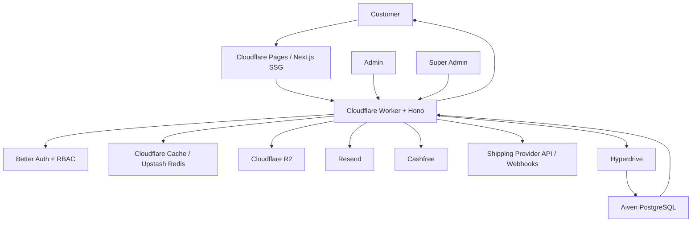

# ECOMMERCE PROJECT - MASTER SOURCE OF TRUTH

## CURRENT CHECKPOINT — Phase 11b-3B authenticated continuation — 2026-09-29

**Operator reports local Chrome Google sign-in success; independent authenticated browser checks remain BLOCKED. Phase 11b is OPEN and NOT SAFE TO DEPLOY.** A read-only database query found 1 Google account, 1 unexpired CUSTOMER session, and 1 CUSTOMER role assignment, with the retained Admin, Super Admin, category, and product counts unchanged. No identity or token was exposed. These aggregate results support callback success but do not prove `/api/me`, role scope, refresh, or logout in the operator's browser.

The isolated debugging Chrome profile started for this continuation remained signed out: Better Auth returned no session, `/api/me` returned 401, and `/account` showed signed-out UI. The user's successful login is in a different profile. Signed-out customer and privileged routes returned 401; the static frontend export contained none of the checked local secrets. Authenticated wishlist, cart, addresses, quote, UI, security, and cross-customer checks were not executed; no synthetic data, order, payment, or deployment was created. Backend TypeScript and 64/64 tests, frontend TypeScript and lint, and `git diff --check` passed. Cashfree remains PARKED; production HTTPS OAuth is unverified.

**Exact next task:** Complete Google sign-in in the isolated Chrome profile on port 9222, then perform the authenticated CUSTOMER session, persistence, logout, endpoint, UI, and cleanup checks described in `docs/BACKEND_VERIFICATION.md`. Use a second real authorized Google account for live isolation only if available. Do not mark Google VERIFIED LOCALLY until the browser session and logout sequence pass.

## CURRENT CHECKPOINT — Phase 11b-3B — 2026-09-29

**Google customer OAuth: BLOCKED before authenticated consent/callback. Phase 11b remains OPEN and NOT SAFE TO DEPLOY.** The 11b-3A `redirect_uri_mismatch` is historical; this real Chrome attempt reached Google's rendered account-entry screen without that error. No authenticated customer success is claimed.

The application generated `http://127.0.0.1:8787/api/auth/callback/google`, exactly the expected local callback. The authorization request used Google's provider, a configured client ID (redacted), `response_type=code`, scopes `email profile openid`, and a present `state`. Google Cloud Console's registered URI and the intended account's External-app Test users membership were not directly accessible, so both require operator confirmation. No test identity was guessed or entered. Consent, callback, CUSTOMER role, session persistence, logout, wishlist, cart, address, quote, and cross-customer isolation remain unverified. Signed-out `/api/me` returned 401. No auth, Cashfree, fixture, schema, or deployment changes were made.

**Exact next task:** Confirm the current Google OAuth client's authorized redirect URI and the intended account's Test users membership in Google Cloud Console; finish real browser sign-in and then verify authenticated customer session and endpoints using the retained product. Do not place a payment order or start Phase 11c. Detailed evidence and checks: `docs/BACKEND_VERIFICATION.md`.

## CURRENT CHECKPOINT — Phase 11b-3A — 2026-09-29

**Phase 11b: OPEN. NOT DEPLOYED. NOT SAFE TO DEPLOY.** These statements describe the current local changes; earlier Worker deployment evidence is historical. This checkpoint supersedes all older status, “current”, “latest”, and next-task statements below. Retained historical evidence is not a claim about today's environment.

- Architecture remains Next.js 16.3.6 / React 19 / TypeScript / Tailwind 4 / shadcn/ui with `output: "export"`; Cloudflare Workers / Hono / Better Auth / Drizzle; Aiven PostgreSQL through Hyperdrive. No schema or migration change in 11b-3A.
- Development origins: frontend `http://127.0.0.1:3000`, API `http://127.0.0.1:8787`. Earlier localhost/8788 evidence is historical. Public environment examples now use these IPv4 origins; R2 stays blank in the example.
- Retained development data: **1 active Admin, 1 Super Admin, 0 customers, 1 category, 1 product**. Product is **published, featured=true, inventory=12**. Category: `phase11b2-accessories-730d72e64790`; product: `phase11b2-cotton-tote-730d72e64790`.
- **R2: real development image uploaded; HTTPS r2.dev retrieval verified; Chrome rendering verified. Production custom domain NOT configured.** The existing authorized Admin upload endpoint and existing `shop-product-images` bucket were used. No second bucket. Ignored `frontend/.env.local` sets `NEXT_PUBLIC_R2_PUBLIC_BASE_URL=https://pub-568301fa6e09442d9faf61b0274abb0c.r2.dev`; application source resolves it only through `src/lib/images.ts`.
- Retained object key: `products/c549089e-32fb-4217-96d7-35dc5a40eb70/2e9b6eb9-497e-486a-9310-d24091637c42.png`. Prior HTTPS response: 200, image/png, 68 bytes. Prior Chrome verified direct URL, home product card and detail gallery; no R2 credentials appeared in public product JSON or image request URL. This phase reuses that object.
- **Google: External audience; browser still fails `redirect_uri_mismatch`; CUSTOMER session NOT VERIFIED.** Known callback: `http://127.0.0.1:8787/api/auth/callback/google`. No Google success is claimed or retested in this reconciliation.
- **Cashfree: PARKED.** No credentials, endpoint, adapter, payment flow, or Razorpay change.
- Minimal public/static `/admin/setup` uses existing `POST /api/admin/activate`. Email URL construction accepts HTTPS, plus only the exact local HTTP origin above. Token is removed from the browser URL, kept in memory only, submitted with no referrer, and consumed by the existing hashed-token/expiry/password activation flow. Activation leaves seller approval separate; no Admin dashboard or RBAC bypass was added. Real email delivery remains unverified.
- Static home and public category/product slug routes remain active. Private `/orders/[id]` and `/orders/[id]/tracking` remain inactive; fixed `/orders` retains inline details/tracking.
- **Exact next task:** Google browser OAuth verification → authenticated CUSTOMER session → wishlist/cart/address/checkout quote verification. Do not start Phase 11c Admin UI.

### Targeted corrections

| Boundary | Current contract |
| --- | --- |
| Admin products | `adminApi.products()` uses distinct `AdminProductSummary[]` plus limit/offset. It matches the existing Admin endpoint; no public Product coercion. |
| Customer orders | Explicit whitelist: customer order ID/number, order/payment status, created/delivered timestamps, currency/totals, contact/address snapshot, and item ID/product/variant/name/title/quantity/historical unit price/total. No Admin/customer foreign key, operational snapshots or finance internals. |
| Customer tracking | Shipment ID, carrier, AWB, public tracking URL, normalized status, estimated/delivered dates, events (status/location/description/eventTime). No Admin ID, provider status/payload or provider operational IDs. Ownership is checked before reading shipments; operator responses are unchanged. |
| R2 request boundary | Actual streamed bytes capped at 5,500,000 before multipart parsing, even without a usable Content-Length; oversized declared requests rejected immediately. Parsed file maximum remains 5,000,000 bytes. MIME/magic bytes, authorization, ownership/category scope, generated keys and R2 cleanup on DB failure retained. |
| Browser verification | Read-only storefront script imports the actual image helper and reads the public environment base; checks real image DOM/decoding and HTTPS 200 image response. Existing upload script is explicitly marked MUTATING; not rerun here. |

### Phase 11b-3A verification

Backend unit tests: **64/64 PASS**, including auth/security, customer projection/ownership and upload limits. Backend TypeScript: PASS. Frontend lint and production static export: PASS. Static build includes `/`, both retained fixture slug pages and `/admin/setup`.

Invitation integration: **PASS in real headless Chrome**, generated invitation link → static setup page → existing activation API → ACTIVE account; verified stored password hash, hashed token, expiry/reissue/reuse rejection and audit events. Temporary unique Aiven invitation records were cleaned. Desktop 1440×900 and mobile 390×844 reviewed, no horizontal overflow; mismatch recovery and token removal passed. No real email sent.

Final checks: backend `npm run typecheck`, `npm test` (**64/64**), `npx drizzle-kit check`; frontend `npm run typecheck`, `npm run lint`, `npm run build`; and `git diff --check` **PASS**. Read-only Aiven readiness after invitation cleanup confirms ADMIN=1 (ACTIVE), SUPER_ADMIN=1, CUSTOMER=0, categories=1, products=1.

Updated `node scripts/verify-phase11b3-browser.mjs`: **PASS** for all ten storefront routes, exact-origin browser API reads, signed-out protection, real home-card/detail image, centralized helper URL and HTTPS 200. Existing `verify-phase11b3-r2-browser.mjs`: **PASS** for direct image URL opening, image rendering and no R2 credential-like fields in public product JSON or credentials in the browser image request URL. These checks do not establish authenticated customer behavior.

The first static export reused a legacy catalog fetch-cache entry containing an empty image array. That specific build-cache directory was preserved under `.next/cache/fetch-cache-before-phase11b3a` and a fresh build passed with the real image. A retry hit a Chrome profile lock inside the frontend scan; the task-created profile was moved outside the frontend and the build then passed. When catalog/media changes, build from fresh catalog data and rerun the image assertion; a successful compilation alone does not prove a fresh export. No pre-existing Wrangler sidecars were removed or reset.

No unexplained current-state contradictions remain in these reconciled checkpoints. Older contradictory evidence is explicitly historical. Remaining gates: Google consent/callback/session and authenticated customer flows, production R2 custom domain, real invitation email delivery and production host/cookie verification. Cashfree stays PARKED. No deployment, staging or commit.

**HISTORICAL CHECKPOINT — SUPERSEDED: Phase 11b-3 R2 development-media verification (2026-09-29):** `NEXT_PUBLIC_R2_PUBLIC_BASE_URL` now supplies the configured development R2 public base locally; the frontend image helper validates it as HTTPS and resolves stored product object keys with per-segment encoding. The local Worker uses the existing `shop-product-images` binding in remote mode for development only, without deployment. An approved Admin uploaded one 68-byte PNG using `POST /api/admin/products/:productId/images/upload`; the returned object key was stored with the fixture product and its public HTTPS URL returned `200 image/png`. Headless Chrome opened that URL and loaded it on both the fixture product detail and home-page product card. Browser public-product data and the R2 image request URL contained no R2 credential-like fields or query credentials. This `r2.dev` URL is a development verification base only, not a production-domain decision. Google customer OAuth and authenticated customer flows remain open; no deployment occurred.

**HISTORICAL CHECKPOINT — SUPERSEDED: Phase 11b-3 update (2026-09-29):** A narrow Admin-only product-image upload API now targets the existing `shop-product-images` R2 bucket. It validates PNG/JPEG/WebP content, limits files to 5 MB, generates product-scoped keys, and stores metadata only after an authorized upload. No image was attached to the Aiven fixture because no real public R2 custom domain is confirmed; `NEXT_PUBLIC_R2_PUBLIC_BASE_URL` stays blank and the storefront fallback remains visible. Local frontend and Worker settings now use `127.0.0.1` consistently; real Chrome checks passed for public and logged-out customer pages. Google sign-in reached Google but failed with **Error 400: redirect_uri_mismatch**, so no customer session or authenticated wishlist/cart/address/quote flow was verified. Static export still builds the category and product slugs. No deployment occurred. Phase 11b remains **OPEN / NOT SAFE TO DEPLOY**.

**HISTORICAL CHECKPOINT — SUPERSEDED: Phase 11b-2 update (2026-09-29):** One controlled test Super Admin and one fully onboarded, approved test Admin now exist in development Aiven via the existing private bootstrap and invitation/onboarding workflow. The retained `phase11b2-` category and product fixture is published, in stock, and featured. Static category/product pages and metadata now build from those real slugs. Product images remain on the missing-image fallback because there is no public product-image upload binding or R2 domain. Customer identity, Google browser OAuth, Resend delivery, and Cashfree remain unverified or blocked. No deployment occurred. Phase 11b remains **OPEN / NOT SAFE TO DEPLOY**. See the latest checkpoints in `BACKEND_VERIFICATION.md` and `FRONTEND_API_MAPPING.md`.

**Purpose:** Permanent compact project specification for humans and AI coding agents.

**Rule:** Read this document before planning, changing architecture, changing schema, creating routes, or writing feature code. Do not invent architecture that conflicts with this document. This document intentionally combines project decisions, workflows, schema, routes, UI responsibilities, security, caching, SEO, and implementation order so an AI does not need to load many duplicated files.

**Current baseline:** Phase 11b-3A, 2026-09-29. The CURRENT CHECKPOINT at the top is authoritative; older checkpoints are retained as historical evidence.

**HISTORICAL CHECKPOINT — SUPERSEDED: Historical Phase 11b-1 update:** Product cards gained image key, availability, published rating/count, and creation time from the public list response without per-card detail reads. Server-backed sort and in-stock filters became available. Customer checkout review gained the read-only quote but did not create an order or payment. At that checkpoint, the configured database had no operator/customer users or catalog data, so fixture creation and static-page activation were pending. The Phase 11b-2 update above supersedes that database and route status.

**HISTORICAL CHECKPOINT — SUPERSEDED: Phase 11b partial checkpoint:** The customer home now fetches real public categories, featured products (`featured=true`), and newest products at static build time. Search and backend-supported price/category/subcategory filtering use URL queries and paginated public API reads. Fixed customer routes implement Google session UI, wishlist, cart, account, addresses, checkout review, orders, and inline normalized tracking. The local Worker returned 200 with empty public categories/products and 401 for protected customer APIs; no authenticated customer or Google browser flow was verified. Static export cannot activate category/product `[slug]` routes while the published catalog is empty, so their source remains `page.pending.tsx`. Private `[id]` paths remain unresolved under static export; order details/tracking are available only as panels on `/orders`. Cashfree is parked, and checkout does not create an order or payment. The R2 public base URL is unconfigured, so media uses missing-image states. The deployed Worker has not received Phase 11e-pre updates. **Phase 11b is not complete and storefront deployment is not safe.** See `docs/FRONTEND_API_MAPPING.md`.

**HISTORICAL CHECKPOINT — SUPERSEDED: Phase 11a frontend:** `frontend/` is now an isolated npm Next.js 16.3.6 App Router package with TypeScript, Tailwind CSS 4, ESLint, source-owned shadcn/ui primitives, warm Ownline design tokens, customer and operator layout shells, data-driven catalog/state components, centralized API and R2 public URL helpers, and public environment examples. `/`, `/search`, `/wishlist`, `/cart`, `/orders`, `/account`, `/admin`, and `/super-admin` are static foundation pages; secondary customer pages are explicit placeholders with no business data. `npm install`, TypeScript, lint, production build, and local HTTP smoke checks passed. No business pages, real data, authentication flow, or deployment were added. The current Cloudflare Pages static export cannot directly emit unpredictable private `[id]` routes; later phases must settle their routing/deployment strategy before implementing them. See `docs/FRONTEND_DESIGN_SYSTEM.md`. **Exact next task: Phase 11b Customer Storefront.**

**HISTORICAL CHECKPOINT — SUPERSEDED: Phase 11e-pre backend:** Additive migration `0008_products_featured_flag.sql` adds `products.featured boolean NOT NULL DEFAULT false` and a partial index. Existing rows remain false; there is no `trending` field. Public `GET /api/products?featured=true` lists only featured published products in published categories/subcategories. Default public product order by `created_at DESC` supplies New Arrivals; Trending is deferred pending a real rule. Admin `GET /api/admin/summary` and `GET /api/admin/products` require an approved Admin and existing permissions; the product list and count respect ownership, active category assignment, and published category. Super Admin `GET /api/super-admin/summary` and `GET /api/super-admin/admins` require the Super Admin role. Summary queries use database aggregates; the Admin list excludes private KYC document keys and internal financial detail. The Featured flag has no management UI/API in this phase and remains false until a deliberate later curation flow or authorized database update.

**HISTORICAL CHECKPOINT — SUPERSEDED: Phase 11e-pre deployment:** Backend code is implemented locally and migration 0008 is applied to Aiven. The Worker has not been redeployed for this phase; the new endpoints are not LIVE VERIFIED. Next implementation task: **Phase 11a Next.js initialization** in the isolated `frontend/` project, after reviewing the backend verification checkpoint.

**Shipping provider baseline:** Shiprocket is the selected V1 shipping/fulfillment integration. The application remains provider-agnostic through a shipping-provider adapter boundary so Delhivery, DTDC, or another provider can be added later without rewriting order logic.

**Return policy baseline (finalized):** Return requests are eligible through **`orders.delivered_at + 5 × 24 hours`** for products that are explicitly return-enabled. The order timestamp is set after all order items have delivered shipments. In V1, **Dress** is the supported returnable main category; all other main categories are non-returnable by default. Admin can enable/disable returns per Dress product. Customer returns are manual and customer-paid; the seller return address is disclosed only after Admin approval. Seller receipt and QC are required before refund authorization. No customer AWB/tracking/proof upload and no live return-courier tracking are required in V1. Refunds are server-calculated and use only explicitly configured policy deductions; customer-paid return courier cost must not be deducted again.

---

## 1. PROJECT IN ONE VIEW

Single-tenant ecommerce platform with three application roles:

- **Customer:** buys products and manages their own account/orders.
- **Admin:** internal seller/store operator; sees only permitted/assigned business data.
- **Super Admin:** platform owner; full platform control.

Public/customer route: `/`
Admin route: `/admin`
Super Admin route: `/super-admin`

Core catalog:

```text
Main Category
    v
Subcategory
    v
Product
    v
Optional Variants
    v
Inventory / Media / Pricing
```

Core authority rules:

```text
Aiven PostgreSQL = SOURCE OF TRUTH
Cache = PERFORMANCE OPTIMIZATION
localStorage = SAFE CLIENT CONVENIENCE STATE
SSG HTML = SEO/PUBLIC DELIVERY
Backend = BUSINESS AUTHORITY
```

---

## 2. FINAL STACK

### Frontend
- Next.js App Router
- TypeScript
- Tailwind CSS
- shadcn/ui
- Static Export / SSG for public SEO pages

### Frontend hosting
- Cloudflare Pages

### Backend
- Cloudflare Workers
- Hono

### Database
- Aiven PostgreSQL
- Drizzle ORM
- Cloudflare Hyperdrive for deployed Worker -> Aiven connectivity/pooling

### Authentication
- Better Auth
- Customer: Google OAuth
- Admin: email/password
- Super Admin: email/password

### Media
- Cloudflare R2
- Existing bucket: `shop-product-images`

### Cache
- Cloudflare cache for public/static content
- Upstash Redis for selective hot/derived cache and rate limiting

### Email
- Resend
- Add credentials when email features are implemented

### Payments
- Cashfree Payment Gateway
- Cashfree Payouts and/or approved manual payout workflow
- Add credentials when payment/payout features are implemented

### Shipping / logistics
- **V1 selected provider: Shiprocket** for the platform's central shipping/fulfillment integration
- Shiprocket acts as the initial multi-courier/fulfillment layer; the actual courier used for a shipment is determined through the provider's courier/serviceability/shipment workflow
- The application uses a **shipping-provider adapter boundary** so provider-specific logic does not spread through orders
- Delhivery remains a supported future/provider alternative; its current developer portal documents shipment tracking, shipment creation, pickup, labels, serviceability, and shipping-cost APIs
- DTDC can be integrated when an approved API/enterprise integration is available and its current capabilities/authentication are verified
- **MCP is not required** for customer-facing shipment tracking; use the provider's REST/HTTPS APIs and webhooks through the backend
- **No mandatory npm shipping package** is required for the Cloudflare Worker path; use Worker `fetch()` plus request/response validation and idempotent webhook handling

### Source control
- GitHub

### UI source rule
Use the official shadcn/ui component/block source first for applicable UI. shadcn puts component source into the project, so the project owns/customizes that code. [Official shadcn docs](https://ui.shadcn.com/docs)

---

## 3. RUNTIME ARCHITECTURE

```text
                         CUSTOMER BROWSER
                               |
              +----------------+----------------+
              |                                 |
              v                                 v
     Cloudflare Pages                      Backend API
     Next.js SSG/HTML                   Cloudflare Worker
              |                               Hono
              |                                 |
              |                  +--------------+--------------+
              |                  |              |              |
              |                  v              v              v
              |              Better Auth      Cache         Services
              |                              Redis/CF       R2/Resend/
              |                                             Cashfree
              |                                 |
              |                                 v
              |                             Hyperdrive
              |                                 |
              |                                 v
              |                         Aiven PostgreSQL
              |                         SOURCE OF TRUTH
              |
              +---- public SEO/static delivery
```

Cloudflare currently documents Next.js static export on Pages and Hyperdrive for PostgreSQL/Workers. Hyperdrive local development supports a direct local/remote PostgreSQL connection, while `wrangler dev --remote` tests the real Cloudflare-side Hyperdrive path. R2 is accessed from Workers through bindings.

---

## 4. CURRENT PROJECT STRUCTURE

This is the current source structure. Generated folders such as `node_modules/` and `.wrangler/` are intentionally not treated as application architecture.

```text
ecommerce/
+-- agents/
+-- backend/
|   +-- drizzle/
|   +-- src/
|   |   +-- admin/
|   |   +-- constants/
|   |   +-- db/
|   |   +-- lib/
|   |   +-- middleware/
|   |   +-- modules/
|   |   +-- routes/
|   |   +-- services/
|   |   +-- super-admin/
|   |   +-- types/
|   |   +-- utils/
|   |   +-- validators/
|   |   +-- index.ts
|   +-- .dev.vars
|   +-- .env
|   +-- .env.example
|   +-- drizzle.config.ts
|   +-- package.json
|   +-- package-lock.json
|   +-- wrangler.jsonc
+-- docs/
+-- frontend/
    +-- public/
    +-- src/
    |   +-- app/
    |   |   +-- (customer)/
    |   |   +-- admin/
    |   |   +-- super-admin/
    |   |   +-- layout.tsx
    |   |   +-- globals.css
    |   +-- components/
    |   +-- constants/
    |   +-- features/
    |   +-- hooks/
    |   +-- lib/
    |   +-- types/
    |   +-- validators/
    +-- .env.example
    +-- .env.local
    +-- middleware.ts
    +-- next.config.ts
    +-- package.json
    +-- tsconfig.json
```

Do not recreate `backend/` or `frontend/` elsewhere.

---

## 5. ENVIRONMENT RESPONSIBILITY

### Frontend - `frontend/.env.local`

Only browser-safe public values:

```env
NEXT_PUBLIC_SITE_URL=http://127.0.0.1:3000
NEXT_PUBLIC_API_URL=http://127.0.0.1:8787
```

Never put private secrets here.

### Backend Worker local runtime - `backend/.dev.vars`

Server-side values:

```env
DATABASE_URL=
BETTER_AUTH_SECRET=
BETTER_AUTH_URL=http://127.0.0.1:8787
GOOGLE_CLIENT_ID=
GOOGLE_CLIENT_SECRET=
UPSTASH_REDIS_REST_URL=
UPSTASH_REDIS_REST_TOKEN=
CASHFREE_CLIENT_ID=
CASHFREE_CLIENT_SECRET=
CASHFREE_ENVIRONMENT=SANDBOX
PAYOUT_CLIENT_ID=
PAYOUT_CLIENT_SECRET=
PAYOUT_ENVIRONMENT=SANDBOX
RESEND_API_KEY=
RESEND_FROM_EMAIL=
```

### Backend tooling - `backend/.env`

Keep minimal for local tools such as Drizzle, especially:

```env
DATABASE_URL=YOUR_AIVEN_POSTGRES_URL
```

### Templates

```text
backend/.env.example
frontend/.env.example
```

Templates contain names/placeholders only, never real secrets.

### Cloudflare resources

R2 and Hyperdrive should use Worker bindings/configuration where possible. Do not expose those credentials to the browser.

### Shipping provider secrets

V1 selected provider is **Shiprocket**. Keep the Shiprocket API user credentials in Worker-side secrets only. Shiprocket's current API flow uses an API user created in the Shiprocket panel, then an authentication request to generate a Bearer token; the token is currently documented as valid for 10 days. Do not store the Bearer token in frontend code or `NEXT_PUBLIC_*` variables.

Local development (`backend/.dev.vars`) may contain placeholders such as:

```env
SHIPPING_PROVIDER=shiprocket
SHIPROCKET_API_USER_EMAIL=
SHIPROCKET_API_USER_PASSWORD=
SHIPROCKET_WEBHOOK_TOKEN=
```

Production should use Cloudflare Worker secrets/secret bindings for these private values. Do not add credentials for Delhivery/DTDC unless and until that provider is actually selected.

Return policy configuration is business configuration, not a guessed hardcode:

```env
RETURN_WINDOW_DAYS=5
```

`RETURN_WINDOW_DAYS` is measured from `orders.delivered_at`. The current finalized V1 value is 5 days. Do not use the carrier's 5-7 day delivery estimate as the return window; those are separate concepts.

The Shiprocket webhook endpoint should be a neutral path such as `/webhooks/shipping/events`; the provider's current webhook guidance says not to include keywords such as `shiprocket`, `kartrocket`, `sr`, or `kr` in the webhook URL.

Do not print, commit, or expose provider credentials.

---

## 6. INFRASTRUCTURE BASELINE

Already selected/created:

- Aiven PostgreSQL
- Cloudflare account + Wrangler authentication
- R2 bucket `shop-product-images`
- Upstash Redis
- Google OAuth credentials
- Better Auth
- Hyperdrive configuration `ecommerce-db`
- Backend package/project setup
- Frontend/backend split

Current local development model:

```text
wrangler dev
    v
local Worker runtime
    v
local Hyperdrive connection string
    v
Aiven PostgreSQL
```

Production:

```text
Cloudflare Worker
    v
HYPERDRIVE binding
    v
ecommerce-db
    v
Aiven PostgreSQL
```

Do not create a second Hyperdrive configuration with the same purpose/name.

---

## 6A. SHIPROCKET ACCOUNT SETUP + BACKEND CONNECTION (V1)

Shiprocket is the selected V1 shipping/fulfillment provider for the single-tenant ecommerce platform. The Shiprocket account is a **central business/platform account controlled by the Super Admin/business owner**, not one separate Shiprocket account per Admin seller.

This is important because the project is single-tenant:

```text
Single Ecommerce Platform
        v
Central Shiprocket Account
        v
Admin A pickup location
Admin B pickup location
Admin C pickup location
        v
Actual courier partner selected through Shiprocket
```

### 6A.1 What is created now vs later

**Create the provider account now** because account onboarding, KYC, company information, pickup-address verification, and API-user access are external dependencies that can take time.

**Do not integrate shipment creation into the production ecommerce flow yet** while the core database/Drizzle foundation is still being verified. Complete the external onboarding now, then connect the API when the backend reaches the Shipping + Tracking phase.

Recommended sequence:

```text
Create Shiprocket account
        v
Complete company/KYC/bank/pickup setup
        v
Create Shiprocket API user
        v
Keep API credentials server-side
        v
Continue backend/database implementation
        v
Deploy public Worker endpoint
        v
Configure tracking webhook
        v
Implement ShiprocketAdapter
        v
Test serviceability/tracking safely
        v
Enable production shipment creation
```

### 6A.2 Create the Shiprocket account

1. Open the official Shiprocket website and choose the seller signup flow.
2. Create the central business/platform shipping account.
3. Verify the registered mobile/email.
4. Complete the company/registered-address information shown during onboarding.
5. Complete the required KYC process.
6. Add the required bank/payment information and wallet funding according to the current Shiprocket onboarding requirements.
7. Add the physical pickup locations used by the business.

Shiprocket's current onboarding guidance asks for company information, KYC verification, bank details, a pickup address, and wallet funds before shipping. Exact KYC documents vary by business type, so use the current Shiprocket onboarding screen as the final authority.

Important distinction:

```text
Your ecommerce Admin KYC
        !=
Shiprocket account KYC
```

Your platform's Admin KYC is part of your own Super Admin approval workflow. Shiprocket's KYC is for the central shipping-provider account.

### 6A.3 Create the Shiprocket API user

After the Shiprocket account is active:

```text
Shiprocket Panel
  -> Settings
  -> API
  -> Configure / Add New API User
  -> Create API User
```

Use a dedicated API-user email that is different from the main Shiprocket login email.

Give the API user only the modules required for the integration. For the V1 application, the expected areas are:

- Couriers / serviceability
- Orders
- Shipments
- Tracking
- Pickup addresses
- Webhooks

Do not grant unrelated modules unless a future requirement needs them.

Shiprocket's current documentation states that API credentials are created from the API settings area and are then used with the Authentication API to generate a Bearer token. The token is documented as valid for 10 days.

### 6A.4 Backend secret configuration

Do not put the Shiprocket API user/password in the frontend.

Local Worker runtime:

```env
SHIPPING_PROVIDER=shiprocket
SHIPROCKET_API_USER_EMAIL=your-api-user-email
SHIPROCKET_API_USER_PASSWORD=your-api-user-password
SHIPROCKET_WEBHOOK_TOKEN=your-webhook-security-token
```

Use the actual values only in the private local/production secret stores. Never commit them.

Do not paste real credentials into `PROJECT_CONTEXT.md`, README files, GitHub issues, source files, screenshots, or frontend environment variables.

### 6A.5 Shiprocket authentication from the backend

The Worker should authenticate server-side against the documented authentication endpoint:

```text
POST https://apiv2.shiprocket.in/v1/external/auth/login
```

Conceptual request:

```text
backend Worker
   v
Shiprocket auth endpoint
   v
Bearer token
   v
ShippingService / ShiprocketAdapter
   v
Shiprocket APIs
```

The application should treat the token as a short-lived integration credential. Do not expose it to the browser. Because Workers are ephemeral, do not make in-memory token storage a correctness requirement; the adapter may re-authenticate when a usable token is not available.

Do not make Redis a mandatory dependency for payment/shipping correctness just to persist this token. Redis can be used later as an optimization if there is a measured need.

### 6A.6 Pickup address model

The central Shiprocket account can contain multiple pickup locations. Each internal Admin has a platform-level operational `SHIPPING_ORIGIN` address. The shipping integration must map the correct Admin address to the provider pickup location used for that shipment.

Use the platform's existing address model first:

```text
Admin
  v
admin_addresses
  v
SHIPPING_ORIGIN
  v
provider-specific pickup-location mapping
  v
Shiprocket pickup location
```

The Admin's own Shiprocket login/account is **not** required by this design.

For a future multi-provider setup, keep the mapping provider-specific rather than adding Shiprocket-only fields throughout `orders`.

Recommended mapping table if provider-specific location identifiers are needed:

#### `shipping_provider_locations`

```text
id                 PK
admin_id           FK -> admins.id
admin_address_id   FK -> admin_addresses.id
provider_key
provider_location_ref
location_name
status
created_at
updated_at
UNIQUE(provider_key, admin_address_id)
```

Use this mapping to associate a platform Admin shipping-origin address with the external provider's pickup-location identifier.

### 6A.7 Public tracking webhook

The customer/Admin live tracking system should not poll the carrier directly from the browser.

The backend receives provider events:

```text
Shiprocket
   v
HTTPS POST webhook
   v
Cloudflare Worker
   v
Validate webhook/security token
   v
Idempotency check
   v
Normalize provider status
   v
Persist shipment_events
   v
Update shipments
   v
Customer/Admin tracking UI
```

Use a neutral webhook route such as:

```text
POST /webhooks/shipping/events
```

A local `127.0.0.1` or `localhost` URL is not suitable as a production provider webhook destination. Configure the provider webhook against the deployed public Worker URL when that endpoint is ready.

Shiprocket's current API documentation describes webhook setup under `Settings -> API -> Webhooks`, where tracking events are sent as POST requests to the configured callback URL. Use a provider security token when supported and validate it at the backend boundary.

### 6A.8 Safe first API tests

Do not begin by creating a real shipment just to prove authentication works. Shiprocket's API documentation warns that valid API requests can affect real-time account data.

First test only the smallest safe calls needed to prove:

```text
1. API user authentication
2. token generation
3. courier/serviceability lookup
4. pickup-location lookup
5. tracking lookup for a known/test shipment when available
```

Only after those checks pass should the production shipment-creation workflow be enabled.

For development, use a test/staging account or a deliberately controlled test shipment if Shiprocket's current account setup provides one. Verify current sandbox/test availability directly from Shiprocket before assuming a sandbox endpoint exists.

### 6A.9 Application integration boundary

Do not write Shiprocket API calls directly inside `orders` route handlers.

Use:

```text
Order / Fulfillment module
        v
ShippingService
        v
ShippingProvider interface
        v
ShiprocketAdapter
        v
Shiprocket REST API
```

Example conceptual operations:

```text
ShippingService.createShipment()
ShippingService.getServiceability()
ShippingService.getTracking()
ShippingService.syncTrackingEvent()
```

The exact provider request/response shape stays inside the adapter.

### 6A.10 V1 shipping integration scope

Build in this order:

```text
A. Provider authentication
B. Provider config validation
C. Admin pickup-address mapping
D. Order -> shipment creation
E. AWB/shipment reference persistence
F. Tracking webhook ingestion
G. Normalized shipment status
H. Customer tracking page
I. Admin order tracking view
J. Delivery exception / RTO handling
```

Do not build return-courier live tracking in V1.

The forward shipment is the provider-tracked delivery journey. The manual customer return remains a platform-managed return state plus seller receipt/QC/refund workflow.

### 6A.11 Provider replacement rule

Shiprocket is the V1 implementation, not a permanent hard-coded dependency in the domain model.

```text
ShippingProvider
      |
      +--> ShiprocketAdapter   (V1)
      +--> DelhiveryAdapter     (future/alternative)
      +--> DtdcAdapter          (future/alternative)
      +--> OtherProviderAdapter (future)
```

Changing providers should primarily replace the adapter/configuration and provider-specific integration details, not the core `orders`, `shipments`, customer tracking, or Admin order logic.

---

## 7. AUTHENTICATION + AUTHORIZATION

Better Auth is the single auth system.

```text
Customer     -> Google OAuth
Admin        -> Email + Password
Super Admin  -> Email + Password
```

Google login assigns the normal customer identity; privileged roles come from application RBAC, not from OAuth itself.

Password handling:

```text
password
   v
secure password hash
   v
database
```

Passwords are **hashed, not reversibly encrypted**. Never log, return, or store plaintext passwords.

Authorization:

```text
Session
  v
User
  v
Role(s)
  v
Effective Permissions
  v
Backend authorization
  v
Allowed operation
```

Example permissions:

```text
products.view
products.create
products.update
products.delete
inventory.view
inventory.update
orders.view
orders.update
customers.view
customers.message
reviews.view
reviews.moderate
analytics.view
earnings.view
payouts.view
payouts.request
```

Frontend may hide unavailable UI, but backend permission checks are mandatory.

---

# 8. ROLE DATA ISOLATION

## Customer

Customer can access only their own:
- profile
- addresses
- cart
- wishlist
- orders
- payments related to their orders
- reviews
- notifications
- support records

## Admin

Admin is an internal seller.

Admin sees only:
- products assigned to that Admin
- variants/inventory for assigned products
- order items belonging to assigned products
- related customer/order information allowed by permission
- own earnings/revenue
- own payout requests/settlements
- assigned review/moderation work
- permitted analytics

Admin does not automatically see another Admin's products, orders, revenue, or private business data.

Recommended ownership model:

```text
products
   <->
product_admins
   <->
admins
```

For order-level isolation, `order_items.admin_id` stores which Admin owns the sale item at order time.

## Super Admin

Super Admin can see platform-wide data and control platform rules.

---

## 8A. ADMIN SHIPPING ORIGIN + RETURN ADDRESS SETUP

Every Admin who operates as a seller must configure the actual operational addresses used for fulfillment before their products can be fulfilled. These addresses are part of the seller onboarding/verification workflow and must be reviewed as part of Super Admin approval. At minimum, the Admin must provide:

1. **Shipping origin / pickup address** - the real location from which the seller sends customer orders.
2. **Return address** - the real location to which approved customer returns are manually shipped by the customer.

Required address information should be sufficient for courier delivery and return, including:

```text
contact / business name
phone
address line 1
address line 2 (optional)
city
state
postal code
country
```

Rules:
- The Admin must configure both addresses during seller onboarding / account setup before fulfillment is enabled.
- The backend must validate that the required fields are present before allowing fulfillment/shipment creation.
- Super Admin must review the submitted addresses during Admin verification and can correct/update them before approval.
- The shipping-origin address is used for forward shipment creation/pickup.
- The return address is shown to a customer **only after the seller/Admin approves the return request**.
- Do not expose seller return addresses publicly on product pages, search pages, or before a return is approved.
- The address used by a shipment/return should be snapshotted for that transaction so later address edits do not rewrite historical shipping records.
- Super Admin can view/manage the platform's Admin shipping configuration and can prevent fulfillment when required operational addresses are missing or the seller is not approved.

### Address ownership

These are Admin operational addresses, not the customer's saved addresses. Keep them in a separate `admin_addresses` domain table.

## 8B. ADMIN SELLER ONBOARDING, KYC APPROVAL + SELLING-CATEGORY SCOPE

Admin seller onboarding is an approval workflow. The Admin account is provisioned/invited through the platform's internal Admin flow; there is no public marketplace seller registration. Creating an Admin account does not automatically make the account an active seller.

### Admin onboarding flow

```text
Admin account created
        v
Seller profile + KYC details submitted
        v
Shipping Origin address + Return address submitted
        v
Selling categories selected
        v
PENDING_SUPER_ADMIN_APPROVAL
        v
Super Admin verification UI
        +----------------------+
        | Check all details    |
        | Edit/correct details |
        | Review KYC evidence  |
        | Review addresses     |
        | Review category scope |
        +----------+-----------+
                   v
             APPROVED
                   v
          ACTIVE SELLER ADMIN
```

### Required Admin onboarding information

The exact KYC fields must follow the business's actual legal/compliance requirements. The application should support the needed seller identity/business information, such as:

- legal/business name
- contact information
- business type when applicable
- government/business identification details when applicable
- KYC/address proof references when applicable
- operational shipping-origin/pickup address
- operational return address
- payout/bank details required for settlement
- requested main selling categories

Sensitive KYC values and documents must be stored/accessed securely and only by authorized users. Do not expose KYC data to customers or unrelated Admins.

### Super Admin verification UI

Super Admin must be able to open an Admin application and review:

- Admin profile information
- submitted KYC details/evidence
- shipping-origin address
- return address
- payout/bank information permitted for verification
- requested selling categories
- current application/status history

When the Super Admin finds a mistake, Super Admin can correct/update the submitted information through the verification UI before approval. Changes to sensitive KYC information must be audited.

The final approval decision is controlled by Super Admin.

Suggested Admin account/application statuses:

```text
DRAFT
PENDING_SUPER_ADMIN_APPROVAL
CHANGES_REQUIRED
APPROVED
ACTIVE
SUSPENDED
REJECTED
```

A seller must not be allowed to publish/fulfill products as an active seller until the required verification state is approved.

### Selling categories are NOT RBAC roles

The Admin's selling category selection is a **business-data scope**, not a role.

Keep these concepts separate:

```text
RBAC role/permissions
        = what the Admin is allowed to do

Selling-category scope
        = which product categories the Admin is allowed to manage/sell
```

Example:

```text
Admin Role:
    SELLER_ADMIN

Permissions:
    products.view
    products.create
    products.update
    inventory.view
    inventory.update
    orders.view
    orders.update

Category scope:
    Dress
    Fancy Items
    Chains
    Necklaces
```

An Admin can have one category or multiple main categories.

### Category-scoped Admin UI

After approval, the Admin dashboard should adapt to the Admin's assigned selling categories.

Examples:

```text
Admin assigned: Dress
        v
Admin product UI exposes Dress-related product workflow
        v
Main Category = Dress
        v
Only Dress subcategories are offered
        v
Dress-specific product fields/options are shown where configured
```

```text
Admin assigned: Gadgets
        v
Main Category = Gadgets
        v
Gadget subcategories are offered
        v
Gadget-specific product fields/options are shown where configured
```

For an Admin assigned to multiple categories:

```text
Dress + Fancy Items + Chains + Necklaces
        v
Admin can select one assigned main category during product creation
        v
Only the selected category's subcategories are available
        v
The product form loads that category's configured fields/options
```

The base product schema remains shared. Category-specific UI should be driven by category configuration rather than creating separate product tables for every category.

### Product-creation enforcement

Backend must enforce category scope, not only the UI.

When an Admin creates a product:

```text
Admin session
   v
RBAC check
   v
Category-scope check
   v
Selected main category belongs to Admin scope?
   +---- no ---> reject
   |
   +---- yes --> load allowed subcategories
                  v
             validate product
                  v
                create
```

An Admin must not be able to submit an API request for a category outside their assigned scope, even if they manipulate the frontend request.

Super Admin can assign/add/remove Admin category scope after approval. Such changes must be audited and must update the Admin UI and backend authorization behavior.

Super Admin can also configure the category's product-form/UI profile (for example, which category-specific fields/options are shown) through category configuration. This changes the shared product form behavior for that category; it does not create a separate product table for each category.

### Recommended table

#### `admin_category_assignments`

```text
id                 PK
admin_id           FK -> admins.id
category_id        FK -> categories.id
status
assigned_by_user_id FK -> users.id
created_at
updated_at
```

Use this table for selling-category scope. Do not create a separate RBAC role for every category.

## 9. CATALOG MODEL

```text
Main Category
      v
Subcategory
      v
Product
      v
Optional Variant
```

### Main Category

Super Admin creates/edits/publishes main categories.

### Subcategory

Belongs to one main category.

Admin can select an existing subcategory and, when permitted, create a custom subcategory under an existing main category.

### Product

Every product belongs to a main category + subcategory.

A product may have zero or more variants.

---

# 10. PRODUCT DOMAIN - WHAT ADMIN ENTERS

Admin product creation workflow:

```text
Main Category
    v
Subcategory
    v
Basic Product Information
    v
Images / Media
    v
Pricing
    v
Optional Variants
    v
Inventory
    v
SEO
    v
Publishing / Status
```

### Basic product information

- product name
- slug
- short description
- full description
- brand when applicable
- SKU for simple/non-variant products
- product status
- currency
- product highlights/specifications

### Media

- primary image
- gallery images
- optional variant images
- alt text
- sort order

Media objects live in R2; metadata/reference lives in PostgreSQL.

### Pricing

- current/base price
- compare-at price where used
- currency
- optional variant-specific price override

### Inventory

- stock quantity
- low-stock threshold
- SKU/variant SKU
- active/inactive state

### SEO

- SEO title
- SEO description
- optional canonical override when required

### Merchandising

- featured
- new
- trending
- other documented storefront flags only when needed

Do not build an oversized generic product-attribute engine before actual product requirements need it.

---

## 11. PRODUCT VARIANTS

Variants are optional. Use them when the product has purchasable combinations such as:

```text
Color: Black / White
Size: S / M / L / XL
```

Example variant records:

```text
Black / S
Black / M
Black / L
White / S
White / M
White / L
```

A variant should carry:

- product_id
- SKU
- barcode when required
- option values (simple structured JSON such as `{ "color": "Black", "size": "M" }` is acceptable)
- optional price override
- optional compare-at price override
- active status
- default flag where needed

Inventory should point to the variant when variants exist.

Do not build a complicated attribute-engine / rules engine unless real catalog requirements force it.

---

## 12. CUSTOMER PRODUCT PAGE

Route:

```text
/products/[slug]
```

Customer sees:

```text
Breadcrumb
v
Product image gallery
v
Product name
v
Brand (if applicable)
v
Rating + review count
v
Current live price
v
Compare-at price (if applicable)
v
Availability
v
Variant selectors
v
Quantity
v
Add to Cart
v
Buy Now
v
Wishlist
v
Highlights
v
Description
v
Specifications
v
Shipping information
v
Return information
v
Reviews (published text reviews + ratings)
v
Related/suggested products
```

Customer must not see:
- Admin margin
- Commission rule
- payout data
- internal IDs
- internal moderation notes
- other Admin data
- private customer data

---

## 13. PRODUCT REVIEW SYSTEM

Reviews are customer-facing product reviews with rating and moderation.

### Current V1 customer review feature

Customer can submit only:

- star rating (1-5)
- optional title
- review message/body

There is **no customer review-image upload in V1**.

Review submission flow:

```text
Customer submits review
        v
PENDING
        v
Super Admin review
   +----+----+
Approve    Reject/Hide
   v
PUBLISHED
```

Only reviews with `status = PUBLISHED` appear on the customer product page.

Review counts and average ratings shown publicly must use published reviews only.

### `product_reviews`

Core fields:

```text
id                 PK
product_id         FK -> products.id
customer_id        FK -> users.id
order_item_id      FK -> order_items.id, nullable
rating             integer 1..5
title              nullable
body               text
status             enum
verified_purchase  boolean
created_at
updated_at
```

Suggested status values:

```text
PENDING
PUBLISHED
HIDDEN
REJECTED
```

Rules:

- A review should be linked to an eligible delivered order item when the business rule requires verified purchase reviews.
- `verified_purchase` is derived from valid order evidence and must not be freely set by the browser.
- New customer reviews always start as `PENDING`.
- Super Admin is the final publication authority. A review cannot become `PUBLISHED` without Super Admin approval.
- Admin may view/moderate reviews for assigned products when permitted, but Admin cannot bypass the Super Admin publication gate.
- Customer can edit/delete their own review according to policy. A material edit to a published review should send it back through moderation when required.
- The public product page shows only `PUBLISHED` reviews.

### `review_images` - FUTURE RESERVED

Keep the table in the logical schema so review-image support can be added later without redesigning the review model.

Current V1 behavior:

- No customer review-image upload control.
- No review-image upload API.
- No review-image moderation workflow.
- No review images shown on the customer product page.
- Do not include review images in the current customer review form or V1 review flow.

Future table shape:

```text
id                 PK
review_id          FK -> product_reviews.id
r2_object_key      text
url                nullable/derived
alt_text           nullable
sort_order
created_at
```

## 14. CURRENT PRICE VS HISTORICAL ORDER PRICE

This is a critical invariant.

### Current catalog price

```text
products.price
product_variants.price  (when a variant override exists)
```

### Historical purchase price

```text
order_items.unit_price
```

Example:

```text
Monday
Product = INR1,999
Customer orders
order_items.unit_price = INR1,999

Wednesday
Admin changes current product price = INR1,499

Current product page = INR1,499
Old order = INR1,999
```

Old orders, invoices, refunds, settlement history, and historical analytics must not recalculate from today's catalog price.

Order items should snapshot the business-critical values needed to reconstruct the purchase:

- product name
- SKU
- variant information/options
- unit price
- quantity
- line subtotal
- discount snapshot
- tax snapshot where applicable
- shipping snapshot where applicable
- final line amount

---

## 15. CHECKOUT PRICE + STOCK SAFETY

Browser, static HTML, Redis, and localStorage can be stale.

Before creating a payment:

```text
Customer Cart
    v
Backend loads current product/variant data
    v
Current price validation
    v
Current stock validation
    v
Coupon validation
    v
Shipping calculation
    v
Final server-side total
    v
Create/update pending order
    v
Snapshot order values
    v
Create Cashfree payment
```

If the price changed since the customer viewed/added the item:

- recalculate
- tell the customer the updated amount
- do not silently charge a stale amount

Never trust frontend values for:

- price
- subtotal
- discount
- coupon result
- stock
- payment success
- order ownership

Protect against overselling with database-side transactional/inventory protection.

---

## 16. ORDER LIFECYCLE

A practical order status flow:

```text
PENDING_PAYMENT
   v
PAID
   v
PROCESSING
   v
SHIPPED
   v
OUT_FOR_DELIVERY
   v
DELIVERED
   v
POST_PURCHASE
```

Exception states such as cancellation, return, refund, or payment failure should be represented explicitly rather than overwriting historical payment/order facts.

Customer sees only their own order history.

Admin sees only order items/orders within their assigned products/data scope.

Super Admin sees all platform orders.

---

## 17. PAYMENT WORKFLOW

```text
Customer
   v
Checkout
   v
Backend validates cart/price/stock/coupon/address/shipping
   v
Create pending order
   v
Cashfree Payment Gateway
   v
Customer pays
   v
Cashfree webhook
   v
Backend verifies webhook/payment state
   v
Payment record updated
   v
Order marked PAID
   v
Fulfillment continues
```

Frontend payment success is not the final authority.

Webhook handling must be idempotent.

Duplicate webhook events must not:
- duplicate orders
- duplicate revenue entries
- duplicate customer notifications
- duplicate payouts

---

## 18. ADMIN EARNINGS + PAYOUT

Admin earnings formula:

```text
Gross Product Sales
- Commission
- Payment Gateway Fee
- Refund Adjustment
= Net Payable
```

Commission is Super Admin revenue.

Payment Gateway Fee is configured by Super Admin and visible to Admin.

Admin flow:

```text
View earnings
   v
Request payout
   v
PENDING / review
   v
Super Admin approves/rejects
   v
Super Admin pays
   v
Record amount + method + reference/transfer ID + proof + timestamp + note
   v
PAID
   v
Admin sees settlement history
```

Possible statuses:

```text
PENDING
UNDER_REVIEW
APPROVED
PAID
REJECTED
FAILED
CANCELLED
```

Admin cannot execute the payout themselves.

---

## 18A. CANCELLATION, RETURN, MANUAL RETURN SHIPPING + REFUND WORKFLOW

The project now supports a controlled return workflow for delivered/eligible orders. Cancellation and return are different business events and must not be represented by one generic status.

### Cancellation before shipment

When a customer requests cancellation before the order is shipped/handed to the courier:

```text
Customer requests cancellation
        v
Backend checks cancellation eligibility/status
        v
Cancel eligible order / order item
        v
Calculate refundable amount
        v
Cashfree refund workflow when payment was captured
        v
Customer receives refund according to the configured refund cycle
```

Any cancellation fee or other permitted deduction must be explicitly defined in the Return/Refund Policy and recorded in the refund calculation. Do not invent a hidden fee at runtime.

### Customer return after delivery

```text
Customer opens delivered order
        v
Customer requests return
        v
Backend validates: delivered_at + 5-day return window + return_enabled + eligible reason
        v
Admin reviews request
        v
APPROVED
        v
Customer can view seller return address
        v
Customer manually ships product to seller
        v
Customer pays courier/return shipping cost directly
        v
Seller receives product
        v
Seller/Admin performs quality/condition inspection
        v
QC accepted or rejected
        v
Eligible refund calculated
        v
Cashfree refund initiated
        v
REFUNDED / COMPLETED
```

### Finalized V1 return eligibility

- Return eligibility starts from `orders.delivered_at`.
- The current V1 return window is **5 calendar days** after delivery.
- The carrier's expected delivery duration (for example, 5-7 days) is separate from the return window.
- The customer can request a return only when the product is explicitly marked `return_enabled = true`.
- In V1, **Dress** is the supported returnable main category. All other main categories are non-returnable by default.
- Admin can decide per Dress product whether returns are enabled.
- Normal condition expectations may include unused/unworn condition, no avoidable damage, genuineness, and required tags/packaging where applicable.
- A verified wrong-item/seller-fulfillment error is a return reason handled as a seller-side exception according to the published policy.
- Any refund deduction must be explicitly defined by policy; do not invent or silently introduce a deduction.
- Because the customer pays the return courier directly, the same courier cost must not be deducted again from the refund.

### Return address visibility

The seller's configured return address is **not shown before return approval**. After Admin approval:

```text
Return APPROVED
      v
Customer Order Return page
      v
Seller return address + return instructions
      v
Customer ships manually
```

The customer is responsible for booking the return courier and paying that courier cost under this workflow. The customer does not need to submit courier tracking/AWB/proof to the platform in V1. The platform customer UI focuses on the return decision/status, seller receipt/QC outcome, and refund status.

### Return receipt and quality check

Admin must not mark a return as refundable merely because the customer submitted a return request. The seller must receive the product and record the inspection result.

Suggested return states:

```text
REQUESTED
APPROVED
CUSTOMER_SHIPPING
RECEIVED
QC_PENDING
QC_APPROVED
QC_REJECTED
REFUND_PENDING
REFUNDED
RETURN_ISSUE
REJECTED
CANCELLED
```

Inspection should record:
- inspected by Admin
- inspection date/time
- product condition
- packaging/accessories condition when relevant
- notes/evidence allowed by the policy
- QC decision

If QC is rejected, the system must record the reason and follow the published return policy for the next step.

### Refund amount

The refund amount must be calculated server-side from immutable order/return facts. A general model is:

```text
Eligible refundable amount
- applicable cancellation/return deductions defined by policy
= Net refund amount
```

Because this workflow also has the customer paying the return courier directly, the same courier cost must not be deducted again from the platform refund unless the policy explicitly defines a separate, non-duplicate charge.

The final refund calculation should be snapshotted in the refund record so it can be audited later.

Refund timing:
- After seller receipt and QC approval, the backend initiates the eligible refund.
- Cashfree/provider refund processing is asynchronous; the customer sees the refund state while it is processing.
- The UI should distinguish `REFUND_PENDING` / processing from a completed credit.
- The platform must show the provider reference/status when available and the configured refund-cycle expectation.

Admin cannot directly mark a customer as refunded without the required backend workflow and payment/refund evidence.

### Customer-facing return status

The customer does not need live courier tracking for the manual return in V1. The customer should instead see a clear platform-managed return status and outcome.

Recommended customer-visible states:

```text
RETURN_REQUESTED
RETURN_APPROVED
RETURN_EXPECTED
RETURN_RECEIVED
QC_IN_PROGRESS
QC_APPROVED
QC_REJECTED
REFUND_PENDING
REFUND_PROCESSING
REFUNDED
RETURN_REJECTED
RETURN_ISSUE_REPORTED
```

The customer return page should explain the current state in normal language, for example:

```text
Return approved - ship the product to the seller's return address.

Return received - seller has received the product.

Quality check in progress - seller is checking the returned product.

Return rejected - the seller did not accept the return; reason is shown when policy permits.

Return issue reported - a return-related complaint/exception requires review.

Refund processing - eligible refund has been initiated and is waiting for provider completion.

Refunded - refund completed.
```

Do not promise a carrier-specific live return location or exact return delivery time in the customer UI unless a future shipping integration explicitly supports and requires it.


## 18B. FORWARD SHIPMENT + LIVE CUSTOMER TRACKING

The forward-delivery live tracking requirement is separate from manual customer returns. Customer/Admin tracking applies to forward shipments handled through the selected shipping provider. Manual V1 returns remain platform-managed status + seller receipt/QC/refund workflow.

Customer order tracking is now a first-class backend feature. The system should show the delivery state and carrier data returned by the selected shipping provider.

### Forward shipment flow

```text
Paid order
   v
Admin prepares shipment
   v
Backend loads Admin shipping-origin address
   v
Create shipment with selected provider
   v
Provider returns shipment/AWB reference
   v
Persist shipment + provider identifiers
   v
Track provider events
   v
Normalize provider status
   v
Customer order tracking page
```

The tracking UI should show, when supplied by the carrier:

- courier/provider name
- AWB / tracking number
- current normalized status
- tracking timeline/events
- last known location when available
- shipped/pickup date
- estimated delivery date when available
- delivery time/window only when the provider actually supplies a time estimate
- last updated timestamp
- delay/exception/RTO information when applicable

Do not invent an exact delivery time if the carrier only provides an estimated date or a delivery window.

### Provider abstraction

Use a provider adapter instead of embedding Delhivery/DTDC/Shiprocket logic throughout the order module:

```text
ShippingService
      |
      +--> DelhiveryAdapter
      +--> ShiprocketAdapter
      +--> DtdcAdapter (when approved API is available)
      +--> FutureProviderAdapter
```

Each adapter maps provider-specific statuses into the platform's normalized shipment statuses.

Example normalized statuses:

```text
CREATED
READY_TO_SHIP
PICKUP_SCHEDULED
PICKED_UP
IN_TRANSIT
OUT_FOR_DELIVERY
DELIVERED
DELAYED
UNDELIVERED
RTO_INITIATED
RTO_DELIVERED
CANCELLED
LOST
```

### Forward tracking vs manual return handling

The shipping-provider integration is primarily for the platform's **forward customer order shipment** and its live delivery status.

For V1 manual returns:

- the customer does not need to connect to or submit data from their chosen return courier
- the customer does not need to upload a return shipping proof
- the platform tracks the business return state through approval, expected/received, QC, issue, and refund statuses
- seller-side operational reconciliation may record a courier/tracking reference later when available, but this is not a customer-facing dependency

### API integration vs MCP

The production customer tracking path should use the shipping provider's HTTPS/REST API/webhook integration through the backend. MCP is not required for the customer runtime. A provider's MCP server may be useful later for AI/operator workflows.

No mandatory shipping npm package is required for the initial Cloudflare Worker implementation. Use Worker `fetch` for HTTP calls, an internal adapter/service boundary, request/response validation, retries where appropriate, and idempotent webhook processing.

Current verified provider documentation:
- Delhivery's current Client Developer Portal documents shipment tracking, shipment creation, pickup requests, labels, serviceability, and shipping-cost APIs.
- Shiprocket's current API documentation includes Tracking, Couriers, Shipments, Return & Exchange Orders, Pickup Addresses, and Webhooks.
- If DTDC is selected, confirm its current API access, authentication, rate limits, tracking coverage, and commercial onboarding directly with DTDC before implementation.

### Tracking sync

Prefer provider webhooks/events when the selected carrier supports them. Use scheduled/polling refresh only as a fallback or reconciliation mechanism.

Store normalized events in PostgreSQL and keep the latest provider payload/reference needed for reconciliation without exposing provider secrets.

Never make a customer-facing tracking page call the carrier directly with a secret credential. The backend remains the integration authority.

### Customer tracking route

Recommended route:

```text
/orders/[id]/tracking
```

Customer can reach it from `/orders/[id]`.

### Admin order tracking view

Admin uses the same backend shipment/tracking service for the orders connected to the Admin's assigned products, but the Admin view contains operational detail appropriate to seller work.

Recommended Admin route:

```text
/admin/orders/[id]
```

When an Admin opens an order from the confirmed/processed order list, the order detail page should show:

- customer/order details allowed by Admin scope
- order and order-item status
- seller/assigned product information
- carrier/provider
- AWB / tracking number
- current normalized shipment status
- shipment timeline/events
- pickup/shipped/out-for-delivery/delivered timestamps when supplied
- estimated delivery date/window when supplied
- last updated time
- delay, exception, undelivered, or RTO information when applicable

The Admin and Customer views must use the same normalized shipment state from the backend. The difference is data scope and UI detail, not duplicated tracking logic.

When an Admin opens a confirmed/processed order, the Admin should be able to follow the same forward-delivery timeline for the customer/order item they are authorized to manage and see whether the shipment has been picked up, is in transit, is out for delivery, delivered, delayed, undelivered, or in RTO.


## 19. ADMIN IMPERSONATION / CONTROLLED ACCESS

Super Admin may enter an Admin dashboard using a temporary access session.

```text
Super Admin
   v
Select Admin
   v
Record reason / notify
   v
Temporary access session
   v
Admin dashboard
   v
Actions
   v
Audit log
   v
Exit
```

Never use the Admin password.

Audit fields must distinguish:

```text
actor_user_id = Super Admin
subject_admin_id = target Admin
access_mode = IMPERSONATION
reason
started_at
ended_at
```

The Admin UI should visibly indicate privileged access mode.

---

## 20. CUSTOMER MANAGEMENT SCOPE

### Super Admin

Can view platform-wide customers with:
- name/contact info allowed by privacy rules
- order count
- total order value
- last order
- ordered/never ordered status
- order history
- permitted management actions
- customer email offer/message capability

### Admin

Can view customer information allowed by Admin permissions and data scope.

Recommended scope for V1:
- customers related to orders containing the Admin's assigned products
- related order history/details that the Admin is authorized to see
- order count/value metrics within that allowed scope
- messaging only with `customers.message` permission

Do not expose unrelated Admin/customer business data.

---

## 21. CUSTOMER ACCOUNT + LOCAL STORAGE

Server/database is authoritative for authenticated data:

- profile
- addresses
- cart
- wishlist
- orders
- notifications
- support

localStorage only for safe convenience state:

- guest cart
- recently viewed products
- filters/sorts
- non-sensitive UI state

Guest cart:

```text
localStorage
   v
login
   v
backend validates
   v
merge into database cart
   v
database cart becomes authoritative
```

A customer signing in on another device should receive server-backed account data.

---

## 22. CACHE STRATEGY

### Cloudflare cache

Use for safe public/static content such as:
- static HTML
- CSS/JS
- public images
- safe public product/category responses

### Upstash Redis

Use selectively for:
- hot public product/category data
- search suggestions
- short-lived derived data
- rate limiting
- temporary cache/locks when genuinely needed

Do not cache:
- private customer account data
- order details
- admin data
- super-admin data
- payment secrets

### Invalidation principle

```text
1. Write authoritative database change
2. Invalidate/update affected cache
3. Rebuild/revalidate affected public SSG output when required
```

Never make cache the business authority.

---

## 23. SEO / STATIC GENERATION

Public storefront uses:

```text
Next.js
   v
Static Export / SSG
   v
Cloudflare Pages
```

Public SEO routes:

```text
/
/products/[slug]
/categories/[slug]
/categories/[slug]/[subcategory]
```

SEO requirements:
- useful server-generated/static HTML content
- title
- meta description
- canonical
- Open Graph metadata
- Product structured data where applicable
- sitemap
- robots
- clean URLs
- internal linking
- indexable product/category content

SSG HTML is never the authority for checkout, price, stock, payment, or permissions.

When product/category content changes:

```text
Database update
   v
cache invalidation/update
   v
Pages rebuild/revalidation strategy
```

Current V1 keeps SSG simple. Do not introduce complex ISR/edge rendering architecture unless static builds become a demonstrated bottleneck.

---

## 24. FRONTEND ROUTES

### Customer

```text
/
/login
/register
/products
/products/[slug]
/categories/[slug]
/categories/[slug]/[subcategory]
/search
/cart
/checkout
/payment
/payment/success
/payment/failed
/orders
/orders/[id]
/orders/[id]/tracking
/orders/[id]/return
/account
/account/wishlist
/account/addresses
/account/support
/contact
/faq
/about
/terms
/privacy-policy
/shipping-policy
/return-policy
```

### Admin

```text
/admin
/admin/onboarding
/admin/products
/admin/inventory
/admin/orders
/admin/orders/[id]
/admin/customers
/admin/reviews
/admin/analytics
/admin/earnings
/admin/payout-requests
/admin/returns
/admin/settings/shipping-addresses
/admin/notifications
/admin/support
/admin/activity
/admin/account
/admin/settings
```

### Super Admin

```text
/super-admin
/super-admin/admins
/super-admin/admins/[id]
/super-admin/admins/[id]/verification
/super-admin/customers
/super-admin/roles
/super-admin/permissions
/super-admin/admin-access
/super-admin/categories
/super-admin/products
/super-admin/orders
/super-admin/finance
/super-admin/commissions
/super-admin/payment-settings
/super-admin/payouts
/super-admin/refunds
/super-admin/shipping
/super-admin/shipping-providers
/super-admin/analytics
/super-admin/notifications
/super-admin/content
/super-admin/recovery
/super-admin/activity-logs
/super-admin/settings
```

---

## 25. FRONTEND UI RESPONSIBILITIES

### Customer UI

Focus on shopping and trust:
- category discovery
- product browsing/search
- product details
- cart/checkout
- payment state
- orders/tracking
- reviews
- account/support
- clear policy links

### Admin UI

Focus on daily seller operations:
- assigned products
- assigned inventory
- related online orders
- customer information allowed by scope
- reviews for assigned products
- analytics within scope
- own earnings
- payout requests
- notifications/activity

### Super Admin UI

Focus on platform control:
- Admin management
- roles/permissions
- platform customers
- category control
- product/order oversight
- commission/gateway fee
- payout processing
- finance
- refunds
- audit
- recovery
- CMS/content
- settings

Role-specific UI should be different where business responsibilities differ. Reuse shared components, not whole dashboards blindly.

---

## 26. FRONTEND FOLDER RESPONSIBILITIES

```text
frontend/src/app/
    routes/pages/layouts

frontend/src/components/ui/
    official shadcn/ui source components

frontend/src/components/shared/
    cross-role reusable UI

frontend/src/components/customer/
    customer-specific UI

frontend/src/components/admin/
    admin-specific UI

frontend/src/components/super-admin/
    super-admin-specific UI

frontend/src/features/
    frontend feature composition/state/helpers

frontend/src/lib/api/
    HTTP client/helpers to backend

frontend/src/lib/auth/
    frontend auth helpers

frontend/src/lib/seo/
    metadata/SEO helpers

frontend/src/lib/local-storage/
    safe client state helpers
```

shadcn/ui's official docs describe its source-code ownership model and the CLI's direct component distribution into `components/ui`.

---

## 27. BACKEND FOLDER RESPONSIBILITIES

```text
backend/src/index.ts
    Worker/Hono entry point

backend/src/routes/
    HTTP endpoints

backend/src/modules/
    shared business logic

backend/src/admin/
    Admin-specific business access/control

backend/src/super-admin/
    Super Admin-specific business access/control

backend/src/db/
    Drizzle/database access/schema

backend/src/middleware/
    auth, RBAC, rate limiting, errors

backend/src/validators/
    request validation

backend/src/services/
    R2, Redis, Resend, Cashfree, pricing adapters

backend/src/lib/
    auth, authorization, cache, security, idempotency, utilities
```

Do not duplicate the same product/order/payment business logic in customer/admin/super-admin route trees.

---

## 28. DATABASE SCHEMA - CORE TABLES

The schema below is the logical V1 schema. Add technical audit timestamps/indices consistently. Avoid creating tables that are not supported by actual features.

### Identity / Auth

#### `users`
```text
id                 PK
name
email             UNIQUE
email_verified
image              nullable
status
created_at
updated_at
deleted_at         nullable
```

#### `admins`
```text
id                 PK
user_id            FK -> users.id, UNIQUE
status
created_at
updated_at
deleted_at         nullable
```

#### `admin_kyc_submissions`
Stores the seller/Admin verification application and its review state.

```text
id                 PK
admin_id           FK -> admins.id
status
legal_name         nullable
business_type      nullable
id_details         JSONB / tokenized-or-protected structure where appropriate
address_proof_ref  nullable
kyc_evidence_ref   nullable
submitted_at       nullable
reviewed_by_user_id nullable FK -> users.id
reviewed_at        nullable
review_notes       nullable
created_at
updated_at
```

Keep actual sensitive document files in an appropriate private storage path and store protected references/metadata in PostgreSQL. Never expose KYC documents through customer/public endpoints.

#### `admin_category_assignments`
Defines which main selling categories an approved Admin can manage. This is business-data scope, not an RBAC role.

```text
id                 PK
admin_id           FK -> admins.id
category_id        FK -> categories.id
status
assigned_by_user_id FK -> users.id
created_at
updated_at
UNIQUE(admin_id, category_id)
```

#### `roles`
```text
id                 PK
name               UNIQUE
description
created_at
updated_at
```

#### `permissions`
```text
id                 PK
key                UNIQUE
description
created_at
```

#### `user_roles`
```text
user_id            FK -> users.id
role_id            FK -> roles.id
PRIMARY KEY(user_id, role_id)
```

#### `role_permissions`
```text
role_id            FK -> roles.id
permission_id      FK -> permissions.id
PRIMARY KEY(role_id, permission_id)
```

Better Auth adds its required session/account/verification tables according to its adapter/schema generation. Do not invent a parallel auth schema.

---

### Catalog

#### `categories`
```text
id                 PK
name
slug               UNIQUE
description        nullable
image_url           nullable
sort_order
status
product_form_config JSONB nullable
created_at
updated_at
```

#### `subcategories`
```text
id                 PK
category_id        FK -> categories.id
name
slug
customized_by_admin_id  nullable FK -> admins.id
sort_order
status
created_at
updated_at
UNIQUE(category_id, slug)
```

#### `brands`
Optional if the store needs brand filtering/management.

```text
id                 PK
name
slug               UNIQUE
status
created_at
updated_at
```

#### `products`
```text
id                 PK
category_id        FK -> categories.id
subcategory_id     FK -> subcategories.id
brand_id           nullable FK -> brands.id
name
slug               UNIQUE
short_description
long_description
base_sku            nullable UNIQUE when used
price              current/base price
compare_at_price   nullable
currency
status
featured
is_new
is_trending
weight              nullable
dimensions          nullable / structured
seo_title           nullable
seo_description     nullable
created_by_admin_id FK -> admins.id
created_at
updated_at
```

#### `product_admins`
Assigns products to one or more internal Admins.

```text
product_id         FK -> products.id
admin_id           FK -> admins.id
PRIMARY KEY(product_id, admin_id)
```

If the business later proves that every product has exactly one Admin, the relationship can be simplified, but do not do that without a real requirement.

#### `product_variants`
```text
id                 PK
product_id         FK -> products.id
sku                UNIQUE
barcode            nullable
option_values      JSONB
price              nullable override
compare_at_price   nullable override
is_default
status
created_at
updated_at
```

#### `product_images`
```text
id                 PK
product_id         FK -> products.id
variant_id         nullable FK -> product_variants.id
r2_object_key
public_url         nullable/derived
alt_text            nullable
sort_order
is_primary
created_at
```

#### `inventory`
One row per simple product or purchasable variant.

```text
id                 PK
product_id         FK -> products.id
variant_id         nullable FK -> product_variants.id
quantity_available
reserved_quantity
low_stock_threshold
updated_at
UNIQUE(product_id, variant_id)
```

---

### Customer / Shopping

#### `addresses`
```text
id                 PK
user_id            FK -> users.id
label
full_name
phone
line1
line2              nullable
city
state
postal_code
country
is_default
created_at
updated_at
```

#### `wishlists`
```text
id                 PK
user_id            FK -> users.id
created_at
updated_at
```

#### `wishlist_items`
```text
wishlist_id        FK -> wishlists.id
product_id         FK -> products.id
created_at
PRIMARY KEY(wishlist_id, product_id)
```

#### `carts`
```text
id                 PK
user_id            nullable FK -> users.id
status
created_at
updated_at
```

For authenticated users, `user_id` is authoritative. Guest carts may remain browser-local until login/merge.

#### `cart_items`
```text
id                 PK
cart_id            FK -> carts.id
product_id         FK -> products.id
variant_id         nullable FK -> product_variants.id
quantity
created_at
updated_at
```

Do not treat stored cart price as authoritative; re-read current price during checkout.

---

### Coupons / Offers

#### `coupons`
```text
id                 PK
code               UNIQUE
name
coupon_type
value
min_order_value    nullable
max_discount       nullable
usage_limit        nullable
per_user_limit     nullable
starts_at
ends_at
status
created_at
updated_at
```

#### `coupon_usages`
```text
id                 PK
coupon_id          FK -> coupons.id
user_id            FK -> users.id
order_id           FK -> orders.id
discount_amount
created_at
UNIQUE(coupon_id, user_id, order_id)
```

---

### Orders

#### `orders`
```text
id                 PK
order_number       UNIQUE
customer_id        FK -> users.id
status
currency
subtotal
shipping_amount
discount_amount
tax_amount         nullable
total_amount
shipping_address_snapshot JSONB
billing_address_snapshot  JSONB nullable
payment_status
placed_at           nullable
created_at
updated_at
```

The address snapshot preserves the order-time address even if the customer's saved address later changes.

#### `order_items`
```text
id                 PK
order_id           FK -> orders.id
admin_id            FK -> admins.id
product_id         FK -> products.id
variant_id         nullable FK -> product_variants.id
product_name_snapshot
sku_snapshot
variant_snapshot   JSONB nullable
unit_price
quantity
subtotal
discount_amount
tax_amount          nullable
total_amount
created_at
```

`admin_id` is the Admin owner of the sale item at order time.

This table is the main protection against historical-price corruption.

---

### Payments / Refunds

#### `payments`
```text
id                 PK
order_id           FK -> orders.id
provider            CASHFREE
provider_order_id   nullable
provider_payment_id nullable
amount
currency
status
paid_at             nullable
created_at
updated_at
```

#### `payment_attempts`
```text
id                 PK
payment_id         FK -> payments.id
attempt_reference
provider_reference nullable
amount
status
failure_code       nullable
failure_message    nullable
created_at
```

#### `cashfree_webhook_events`
```text
id                 PK
provider_event_id  UNIQUE where provided
event_type
signature_valid
payload            JSONB
processed_at       nullable
created_at
```

#### `refunds`
```text
id                 PK
order_id           FK -> orders.id
payment_id         FK -> payments.id
amount
reason
status
provider_reference nullable
created_at
updated_at
```

---

### Reviews

`product_reviews` and `review_images` are defined in Section 13.

---

### Notifications / Support / Communication

#### `notifications`
```text
id                 PK
user_id            FK -> users.id
type
title
message
data              JSONB nullable
read_at             nullable
created_at
```

#### `contact_messages`
```text
id                 PK
user_id             nullable FK -> users.id
name
email
subject
message
status
created_at
updated_at
```

#### `support_tickets`
```text
id                 PK
user_id            FK -> users.id
order_id            nullable FK -> orders.id
subject
status
priority
created_at
updated_at
```

#### `support_messages`
```text
id                 PK
ticket_id           FK -> support_tickets.id
sender_user_id      FK -> users.id
message
created_at
```

#### `customer_email_messages`
```text
id                 PK
sender_user_id      FK -> users.id
recipient_user_id   FK -> users.id
subject
body
campaign_type       nullable
status
sent_at             nullable
created_at
```

---

### Admin Operational Addresses

#### `admin_addresses`
Stores the real seller/fulfillment addresses used for forward shipping and approved manual returns.

```text
id                 PK
admin_id           FK -> admins.id
address_type       enum (SHIPPING_ORIGIN, RETURN)
business_name      nullable
contact_name       nullable
phone
line1
line2              nullable
city
state
postal_code
country
is_active
created_at
updated_at
```

Rules:
- Every fulfillment-enabled Admin must have an active `SHIPPING_ORIGIN` and `RETURN` address.
- Only the appropriate address type may be used for its workflow.
- Address snapshots are stored on shipments/returns so historical records remain stable after an Admin changes addresses.
- Enforce one active/default address per type per Admin at the application/database boundary.

---

### Shipping / Fulfillment

#### `shipments`
One order can produce multiple shipments when order items belong to different Admins or are fulfilled separately.

```text
id                 PK
order_id           FK -> orders.id
admin_id           FK -> admins.id
provider_key
provider_shipment_id nullable
awb_number         nullable
tracking_url       nullable
status
estimated_delivery_date nullable
origin_address_snapshot JSONB
destination_address_snapshot JSONB
shipped_at         nullable
picked_up_at       nullable
out_for_delivery_at nullable
delivered_at       nullable
last_synced_at     nullable
created_at
updated_at
```

#### `shipment_events`
```text
id                 PK
shipment_id        FK -> shipments.id
provider_status    nullable
normalized_status
location           nullable
description        nullable
event_time
raw_payload        JSONB nullable
created_at
```

Store enough provider event data for the customer timeline, troubleshooting, and reconciliation. Avoid storing secrets.

#### `shipping_provider_configs`
Stores non-secret provider configuration/metadata only. Provider secrets remain Worker secrets.

```text
id                 PK
provider_key       UNIQUE
display_name
enabled
capabilities       JSONB nullable
created_at
updated_at
```

#### `shipping_provider_locations`
Maps a platform Admin's operational shipping-origin address to an external provider pickup-location reference. This keeps Shiprocket/provider identifiers out of the core address and order models.

```text
id                 PK
admin_id           FK -> admins.id
admin_address_id   FK -> admin_addresses.id
provider_key
provider_location_ref
location_name
status
created_at
updated_at
UNIQUE(provider_key, admin_address_id)
```

---

### Returns / Return Quality Check

#### `returns`
```text
id                 PK
order_id           FK -> orders.id
customer_id        FK -> users.id
admin_id            FK -> admins.id
status
reason
customer_notes     nullable
approved_at         nullable
received_at         nullable
qc_status           nullable
qc_notes            nullable
return_shipping_charge nullable
gross_refund_amount nullable
deduction_amount    nullable
net_refund_amount   nullable
deduction_breakdown JSONB nullable
refund_id           nullable FK -> refunds.id
requested_at
updated_at
```

`return_shipping_charge` represents a policy-controlled/refund-calculation charge when one exists. If the customer has already paid the manual courier directly, do not double-charge that same amount.

#### `return_items`
```text
id                 PK
return_id          FK -> returns.id
order_item_id      FK -> order_items.id
quantity
reason              nullable
created_at
```

#### `return_shipments`
Stores the return-shipment record used for seller-side receipt/reconciliation. Customer-facing V1 does not require tracking/AWB/proof submission.

```text
id                 PK
return_id          FK -> returns.id
courier_name       nullable
tracking_number    nullable
tracking_url       nullable
status
shipped_at         nullable
delivered_at       nullable
internal_notes     nullable
created_at
updated_at
```

The customer does not need to submit tracking/AWB/proof to the platform in V1. When available, a courier reference may be recorded by an Admin or support/operator for reconciliation, but it is not a customer requirement and is not the basis for customer-facing live tracking.

#### `return_inspections`
```text
id                 PK
return_id          FK -> returns.id
inspected_by_admin_id FK -> admins.id
condition_status
packaging_status    nullable
notes               nullable
decision
inspected_at
created_at
```

The inspection record is the seller's QC decision used before refund authorization.

### Admin Revenue / Payout

#### `commission_rules`
```text
id                 PK
name
rule_type
value
status
starts_at
ends_at             nullable
created_by_user_id  FK -> users.id
created_at
updated_at
```

#### `admin_revenue`
One logical revenue record per Admin/order scope; exact granularity may be order item based if required.

```text
id                 PK
admin_id            FK -> admins.id
order_id            FK -> orders.id
order_item_id       nullable FK -> order_items.id
gross_product_sales
commission_amount
payment_gateway_fee
refund_adjustment
net_payable
status
created_at
updated_at
```

#### `admin_bank_accounts`
```text
id                 PK
admin_id            FK -> admins.id
account_holder_name
bank_name
masked_account_ref
ifsc_or_equivalent  nullable
status
created_at
updated_at
```

#### `payout_beneficiaries`
```text
id                 PK
admin_id            FK -> admins.id
provider_reference nullable
status
created_at
updated_at
```

#### `payout_requests`
```text
id                 PK
admin_id            FK -> admins.id
requested_amount
approved_amount     nullable
status
reason              nullable
reviewed_by_user_id nullable FK -> users.id
reviewed_at         nullable
created_at
updated_at
```

#### `admin_payouts`
```text
id                 PK
payout_request_id  FK -> payout_requests.id
admin_id            FK -> admins.id
amount
method
provider_reference nullable
transfer_id         nullable
proof_r2_object_key nullable
paid_by_user_id     FK -> users.id
paid_at
notes               nullable
status
created_at
updated_at
```

---

### Account Deletion / Recovery / Audit

#### `account_deletion_requests`
For customer deletion workflow.

```text
id                 PK
user_id            FK -> users.id
status
verification_type
requested_at
approved_at         nullable
completed_at        nullable
```

#### `admin_account_deletion_requests`
```text
id                 PK
admin_id            FK -> admins.id
status
reason              nullable
requested_at
reviewed_by_user_id nullable FK -> users.id
reviewed_at         nullable
completed_at        nullable
```

#### `admin_archives`
```text
id                 PK
admin_id            FK -> admins.id
archive_reference
created_at
restored_at         nullable
restored_by_user_id nullable FK -> users.id
```

#### `admin_access_sessions`
```text
id                 PK
actor_user_id      FK -> users.id
subject_admin_id    FK -> admins.id
reason
access_mode
started_at
ended_at             nullable
created_at
```

#### `audit_logs`
```text
id                 PK
actor_user_id      FK -> users.id
action
entity_type
entity_id
metadata           JSONB nullable
ip_address         nullable
user_agent         nullable
created_at
```

---

## 29. TABLE RELATIONSHIP MAP

```mermaid
erDiagram
    USERS ||--o| ADMINS : has
    ADMINS ||--o{ ADMIN_KYC_SUBMISSIONS : submits
    ADMINS ||--o{ ADMIN_CATEGORY_ASSIGNMENTS : scoped
    CATEGORIES ||--o{ ADMIN_CATEGORY_ASSIGNMENTS : assigned
    ADMINS ||--o{ SHIPPING_PROVIDER_LOCATIONS : maps
    ADMIN_ADDRESSES ||--o{ SHIPPING_PROVIDER_LOCATIONS : maps
    USERS ||--o{ USER_ROLES : assigned
    ROLES ||--o{ USER_ROLES : contains
    ROLES ||--o{ ROLE_PERMISSIONS : grants
    PERMISSIONS ||--o{ ROLE_PERMISSIONS : included

    CATEGORIES ||--o{ SUBCATEGORIES : contains
    ADMINS ||--o{ SUBCATEGORIES : customizes
    CATEGORIES ||--o{ PRODUCTS : groups
    SUBCATEGORIES ||--o{ PRODUCTS : groups
    BRANDS ||--o{ PRODUCTS : brands
    PRODUCTS ||--o{ PRODUCT_ADMINS : assigned
    ADMINS ||--o{ PRODUCT_ADMINS : manages
    PRODUCTS ||--o{ PRODUCT_VARIANTS : has
    PRODUCTS ||--o{ PRODUCT_IMAGES : has
    PRODUCT_VARIANTS ||--o{ PRODUCT_IMAGES : has
    PRODUCTS ||--o{ INVENTORY : stocked
    PRODUCT_VARIANTS ||--o{ INVENTORY : stocked

    USERS ||--o{ ADDRESSES : owns
    USERS ||--o{ WISHLISTS : owns
    WISHLISTS ||--o{ WISHLIST_ITEMS : contains
    PRODUCTS ||--o{ WISHLIST_ITEMS : saved
    USERS ||--o{ CARTS : owns
    CARTS ||--o{ CART_ITEMS : contains
    PRODUCTS ||--o{ CART_ITEMS : contains
    PRODUCT_VARIANTS ||--o{ CART_ITEMS : selects

    USERS ||--o{ ORDERS : places
    ORDERS ||--o{ ORDER_ITEMS : contains
    PRODUCTS ||--o{ ORDER_ITEMS : sold
    PRODUCT_VARIANTS ||--o{ ORDER_ITEMS : sold
    ADMINS ||--o{ ORDER_ITEMS : owns_sale_item
    ORDERS ||--o{ PAYMENTS : has
    PAYMENTS ||--o{ PAYMENT_ATTEMPTS : attempts
    PAYMENTS ||--o{ REFUNDS : refunded
    ORDERS ||--o{ REFUNDS : has
    ORDERS ||--o{ COUPON_USAGES : uses
    COUPONS ||--o{ COUPON_USAGES : applied
    USERS ||--o{ COUPON_USAGES : uses

    PRODUCTS ||--o{ PRODUCT_REVIEWS : reviewed
    USERS ||--o{ PRODUCT_REVIEWS : writes
    ORDER_ITEMS ||--o{ PRODUCT_REVIEWS : verifies
    PRODUCT_REVIEWS ||--o{ REVIEW_IMAGES : contains

    USERS ||--o{ NOTIFICATIONS : receives
    USERS ||--o{ SUPPORT_TICKETS : opens
    SUPPORT_TICKETS ||--o{ SUPPORT_MESSAGES : contains
    USERS ||--o{ SUPPORT_MESSAGES : sends
    USERS ||--o{ CUSTOMER_EMAIL_MESSAGES : sends
    USERS ||--o{ CUSTOMER_EMAIL_MESSAGES : receives

    ADMINS ||--o{ ADMIN_REVENUE : earns
    ORDERS ||--o{ ADMIN_REVENUE : produces
    ORDER_ITEMS ||--o{ ADMIN_REVENUE : contributes
    ADMINS ||--o{ ADMIN_BANK_ACCOUNTS : owns
    ADMINS ||--o{ PAYOUT_BENEFICIARIES : owns
    ADMINS ||--o{ PAYOUT_REQUESTS : requests
    PAYOUT_REQUESTS ||--o| ADMIN_PAYOUTS : settles
    ADMINS ||--o{ ADMIN_PAYOUTS : receives

    USERS ||--o{ AUDIT_LOGS : acts
    ADMINS ||--o{ ADMIN_ACCESS_SESSIONS : targeted
    USERS ||--o{ ADMIN_ACCESS_SESSIONS : acts
```



---

### Logistics / return relationships

```text
ADMINS
  +--> ADMIN_ADDRESSES
  +--> SHIPPING_PROVIDER_LOCATIONS
  +--> SHIPMENTS
  +--> RETURNS
  +--> RETURN_INSPECTIONS

ORDERS
  +--> SHIPMENTS
  +--> RETURNS

SHIPMENTS
  +--> SHIPMENT_EVENTS

RETURNS
  +--> RETURN_ITEMS
  +--> RETURN_SHIPMENTS
  +--> RETURN_INSPECTIONS
  +--> REFUNDS
```

---

## 30. DATA WORKFLOWS

### Customer shopping

```text
Customer
 v
Homepage / Category / Search
 v
Product Details
 v
Variant selection
 v
Cart
 v
Checkout
 v
Server validates current price + stock + coupon + address + shipping
 v
Pending Order
 v
Cashfree
 v
Webhook verification
 v
PAID
 v
Processing
 v
Shipped
 v
Out for Delivery
 v
Delivered
 v
Review / Return / Refund / Support
```

### Admin onboarding + category assignment

```text
Admin account created
 v
Seller profile + KYC + operational addresses + requested categories
 v
PENDING_SUPER_ADMIN_APPROVAL
 v
Super Admin verification UI
 v
Review / edit / correct / audit
 v
Approve
 v
Assign category scope + permissions
 v
ACTIVE SELLER ADMIN
 v
Category-scoped Admin UI
 v
Create product
 v
Select assigned main category
 v
Select allowed subcategory
 v
Load configured category-specific fields/options
 v
Save product
```

An Admin with multiple category assignments follows the same flow; the product form is filtered by the selected assigned main category.

### Admin daily business

```text
Admin Login
 v
RBAC
 v
Admin Dashboard
 v
Assigned Products
 v
Inventory
 v
Assigned/related Order Items
 v
Customers within permission/data scope
 v
Reviews
 v
Analytics
 v
Earnings
 v
Payout Request
 v
Settlement history
```

### Super Admin business

```text
Super Admin Login
 v
Platform Dashboard
 v
Admin Management
 v
Roles / Permissions
 v
Categories
 v
Customers
 v
Products / Orders oversight
 v
Commission / Gateway Fee
 v
Payout Requests
 v
Payment / proof / settlement
 v
Finance / Refunds / Audit / Recovery / Settings
```

### Payment verification

```text
Cashfree event
 v
Webhook endpoint
 v
Verify signature/authenticity
 v
Deduplicate event
 v
Update payment
 v
Update order
 v
Create/update revenue impact
 v
Notify customer
```

### Forward shipment tracking

```text
Paid order
 v
Admin fulfillment
 v
Load Admin SHIPPING_ORIGIN address
 v
Shipping provider API
 v
AWB / shipment reference
 v
Persist shipment
 v
Provider webhook/event or polling reconciliation
 v
Normalize status
 v
Persist shipment events
 v
Customer tracking page
```

### Customer return workflow

```text
Delivered + return eligible
 v
Customer requests return
 v
Backend checks policy/window/items
 v
Admin approves or rejects
 v
If approved: expose Admin RETURN address
 v
Customer manually ships product + pays courier fee
 v
Seller receives product
 v
QC inspection
 v
QC approved
 v
Calculate net refund
 v
Cashfree refund initiated
 v
Refund status processing
 v
Refund completed
```

If QC fails, keep the return/refund decision auditable and follow the published policy.

### Product price change

```text
Admin changes current price
 v
Aiven PostgreSQL write
 v
Invalidate/update Redis
 v
Invalidate/update public Cloudflare cache if affected
 v
Rebuild/revalidate public SSG output as required
```

Old order data is never changed.

---

## 31. API ORGANIZATION

```text
backend/src/routes/
+-- auth/
+-- customer/
+-- admin/
+-- super-admin/
+-- webhooks/
    +-- cashfree/
```

Typical API pipeline:

```text
HTTP Request
 v
Route
 v
Authentication
 v
Authorization / RBAC
 v
Zod validation
 v
Business module/service
 v
Drizzle
 v
Aiven PostgreSQL
 v
Response
```

External integrations stay behind services/adapters.

---

## 32. EXTERNAL SERVICE OWNERSHIP

```text
backend/src/services/r2/
    Cloudflare R2

backend/src/services/redis/
    Upstash Redis

backend/src/services/resend/
    Resend

backend/src/services/cashfree/
    Cashfree payments/payouts

backend/src/services/shipping/
    Shipping provider adapters, Shiprocket authentication, shipment creation, tracking, webhook/event normalization, pickup-location mapping, and return-shipment metadata

backend/src/services/pricing/
    server-side price resolution/validation
```

R2: media storage.
Redis: cache/rate limiting.
Resend: email.
Cashfree: customer payment/payout integration.
Aiven PostgreSQL: authoritative business data.

---

## 33. SECURITY INVARIANTS

Always validate on the backend:

- current product/variant price
- stock
- coupon
- shipping totals
- order ownership
- role/permission
- payout status
- payment status

Never expose:

- database password
- Better Auth secret
- Google OAuth client secret
- Cashfree secret
- Resend API key
- Redis token
- private R2 credentials

Never put secrets in `NEXT_PUBLIC_*` variables.
Never store secrets/passwords in localStorage.

Use idempotency for webhook/payment/shipping-event/retry-sensitive operations.

Shipping provider credentials are backend-only. Never call a carrier API directly from the customer browser with a secret token.

Seller return addresses are private operational data. Expose them to the customer only for an approved return associated with that customer/order.

Do not allow a customer to change the seller return address returned by the platform.

Use database transactions for inventory/order/revenue operations that must be atomic.

---

## 34. UI / SHADCN IMPLEMENTATION RULES

When building UI:

```text
Requirement
 v
Check official shadcn/ui component/block
 v
Add/use official source in frontend/src/components/ui/
 v
Compose in feature/page
 v
Customize styles/behavior
```

Use shadcn for common primitives and patterns such as:
- Button
- Input
- Form
- Dialog
- Drawer/Sheet
- Dropdown
- Table
- Card
- Tabs
- Select/Combobox
- Pagination
- Alert
- Toast
- Sidebar
- Data Table patterns

Do not install another UI library unless a concrete requirement cannot be reasonably met.

The current shadcn site documents direct source-code ownership and an AI-friendly composition model.

---

## 35. COMMERCE / TRUST GUIDELINES

Design the storefront and policies around common documented commerce best practices:

- accurate product information
- transparent pricing
- clear shipping information
- clear return/refund information
- authentic reviews
- review moderation/reporting
- customer support
- clear public policies
- transparent promotions
- auditability
- clear order/payment status
- clear return eligibility and return window
- transparent allocation of return/cancellation charges
- seller return address instructions only after return approval
- clear manual-return courier responsibility
- clear product inspection/QC step before refund authorization
- visible refund status and expected refund cycle
- carrier tracking information and delivery-status limitations

Use major ecommerce/service platforms as pattern references, not as sources of copied legal text.

Never copy another company's Terms/Privacy/Return/Refund wording.

### Current Shiprocket setup references

- Shiprocket API documentation: https://apidocs.shiprocket.in/
- Shiprocket account signup guidance: https://support.shiprocket.in/support/solutions/articles/152000000688-how-do-i-sign-up-for-a-shiprocket-account-/
- Shiprocket onboarding requirements: https://support.shiprocket.in/support/solutions/articles/43000607399-what-are-the-basic-details-required-to-start-shipping-with-shiprocket-
- Shiprocket API-user setup: https://support.shiprocket.in/support/solutions/articles/43000604103-how-to-create-an-api-user-can-i-have-more-than-one-api-users-
- Shiprocket API KYC requirements: https://support.shiprocket.in/support/solutions/articles/43000662578-what-documents-are-required-for-kyc-verification-

Verify provider requirements and available features against the live provider documentation when implementation begins; provider UI, onboarding requirements, limits, and commercial terms can change.

---

## 36. SEO CONTENT / POLICY PAGES

Public customer pages should provide clear links to:

```text
/terms
/privacy-policy
/shipping-policy
/return-policy
```

Policies should reflect the real store's:
- payment behavior
- shipping rules
- returns/refunds
- account handling
- review rules
- privacy practices
- Admin/seller fulfillment-origin requirements
- Admin/seller return-address handling and when the address is disclosed
- cancellation eligibility and any permitted cancellation deductions
- customer-paid manual return courier responsibility
- return tracking/proof expectations
- seller receipt and QC/inspection process
- refund calculation, deductions, and refund-cycle expectations
- shipment tracking, estimated delivery dates/windows, and carrier exceptions

### Policy requirements for the finalized return/shipping workflow

#### Shipping Policy
Document:
- seller/pickup-origin processing model
- order handling time
- carrier usage and tracking availability
- estimated delivery dates/windows where provided by the carrier
- split/multi-shipment behavior when applicable
- delivery exceptions, delays, RTO, and lost/damaged shipment handling

#### Return / Refund Policy
Document:
- return eligibility starts from delivered date (`delivered_at`)
- current V1 return window: 5 calendar days from delivery
- carrier delivery estimate (for example 5-7 days) is separate and does not extend the return window unless the business policy is explicitly changed
- Dress is the supported returnable main category in V1
- all other main categories are non-returnable by default
- Admin can enable/disable return per Dress product
- eligible product condition requirements and seller-error/wrong-item exception handling
- return-request approval by Admin
- seller return address shown only after approval
- customer manually ships the return and pays the courier directly
- no customer AWB/tracking/proof submission in V1
- no customer-facing live return-courier tracking in V1
- seller receipt and QC/inspection before refund authorization
- QC checks product condition/genuineness and applicable tags/packaging
- QC rejection consequences and return-issue handling
- exactly which deductions, if any, can reduce a refund
- no duplicate deduction of a courier cost already paid directly by the customer
- refund processing cycle and asynchronous provider status

#### Terms and Conditions
Include customer responsibilities for accurate order data and compliant return shipping, seller fulfillment/address responsibilities, carrier-event limitations, inspection/QC handling, abuse prevention, and the distinction between order cancellation, return approval, refund initiation, and refund completion.

#### Privacy Policy
Document that operational seller addresses and carrier integrations may be processed as required for fulfillment/returns, and disclose the categories of data shared with shipping/payment providers.

---

## 37. DFD LEVELS

### Level 0 - System context

```text
Customer -+
Admin ----+---> Ecommerce Platform ---> Aiven / R2 / Redis / Cashfree / Resend
Super Admin +
```

### Level 1 - Role journeys

Customer: discovery -> checkout -> payment -> delivery -> post-purchase

Admin: login -> assigned products -> inventory -> orders/customers -> earnings -> payout

Super Admin: login -> Admin/customer/platform control -> finance/payout -> audit/settings

### Level 2 - Focused module

Customer: checkout/payment
Admin: customer management or earnings/payout
Super Admin: Admin management/roles/access

### Level 3 - Focused technical process

Customer: payment verification
Admin: payout processing
Super Admin: controlled Admin access/impersonation

Level 3 must be a zoom-in of one Level-2 process, not another full-system overview.

---

## 38. ACCOUNT DELETION

### Customer

```text
Request
 v
Verification
 v
Confirmation
 v
Anonymize/delete appropriate personal data
 v
Preserve legally/business-required order history
 v
Logout sessions
```

### Admin

```text
Request
 v
Verification
 v
Super Admin approval
 v
Deactivate
 v
Hide assigned public products if required
 v
Archive necessary history
```

Recovery requires Super Admin approval.

Do not erase historical financial/order records blindly.

---

## 39. IMPLEMENTATION ORDER

### Phase 1 - Infrastructure verification

- Aiven connection
- Wrangler/Worker
- Hyperdrive
- R2 binding
- Upstash
- environment ownership
- central Shiprocket account/onboarding status (external dependency check only)

### Phase 2 - Backend foundation

- Hono Worker
- `/health`
- database health check
- error handling
- environment/binding configuration

### Phase 3 - Auth foundation

- Better Auth
- Drizzle adapter/schema
- Customer Google login
- Admin email/password
- Super Admin email/password
- session handling

### Phase 4 - RBAC

- roles
- permissions
- user-role mappings
- backend permission middleware
- protected routes

### Phase 5 - Frontend foundation

- Next.js layout
- shadcn foundation
- navigation
- API client
- auth UI shell

### Phase 6 - Admin seller onboarding + category scope

- Admin onboarding/profile
- KYC submission/status
- Super Admin verification UI
- Super Admin correction/edit workflow
- seller approval/suspension states
- shipping-origin + return-address verification
- Admin selling-category assignments
- category-scope enforcement
- category-scoped Admin UI configuration

### Phase 7 - Catalog

- categories
- subcategories
- products
- variants
- product images
- inventory
- Admin assignment
- category-specific product UI/field configuration

### Phase 8 - Customer storefront

- homepage
- category/subcategory pages
- search/filter
- product detail
- wishlist
- review display
    V1: rating + title/message; no image upload/display

### Phase 9 - Cart / Checkout

- guest cart
- authenticated cart
- cart merge
- address
- shipping
- coupon
- current-price validation
- stock protection
- order creation/snapshots

### Phase 10 - Orders / payments

- order lifecycle
- Cashfree
- webhook verification
- payment attempts
- refunds
- invoices

### Phase 10A - Shipping + tracking

- create/complete the central Shiprocket business account and required onboarding before production integration
- create dedicated Shiprocket API user
- store Shiprocket API credentials only in Worker secrets
- Admin shipping-origin/return address setup
- provider pickup-location mapping for Admin shipping-origin addresses
- address validation and snapshotting
- shipping provider adapter boundary
- Shiprocket authentication/token handling
- shipment creation
- AWB/tracking reference persistence
- provider webhook/event ingestion
- normalized shipment statuses
- customer tracking timeline
- Admin order tracking view
- estimated delivery date/window when provider supplies it
- shipment exception/RTO handling
- safe read-only/test verification before enabling real shipment creation

### Phase 10B - Returns + refunds

- cancellation rules
- return eligibility/window
- return request
- Admin approval/rejection
- return address disclosure after approval
- manual customer-paid return shipping
- seller receipt state
- QC inspection
- refund calculation/deduction snapshot
- Cashfree refund initiation/status
- customer refund status and notifications

### Phase 11 - Admin

- products
- inventory
- assigned orders
- customers
- reviews
- analytics
- earnings
- payout request

### Phase 12 - Super Admin

- Admin management
- roles/permissions
- customer management
- categories
- oversight
- commission
- gateway fee
- payouts
- finance
- refunds
- audit
- recovery
- controlled Admin access

### Phase 13 - Supporting services

- R2 media
- Resend
- notification system
- support

### Phase 14 - Performance

- database indexes/query optimization
- Cloudflare cache
- selective Redis
- pagination
- payload reduction

### Phase 15 - SEO / SSG

- metadata
- canonical
- structured data
- sitemap
- robots
- SSG build validation
- public cache/rebuild strategy

### Phase 16 - Testing

- authentication
- RBAC
- admin isolation
- customer isolation
- price changes
- historical order pricing
- stock concurrency
- duplicate webhooks
- refunds
- cache staleness
- localStorage cart merge

### Phase 17 - Deployment

- Cloudflare Pages
- Cloudflare Worker
- Hyperdrive
- Aiven
- R2
- Redis
- Resend
- Cashfree
- production secrets
- custom domains
- OAuth redirect URIs
- webhook URLs
- CORS/origin rules

---

## 40. REQUIRED TEST SCENARIOS

1. Customer sees current product price.
2. Admin changes current price.
3. Existing order keeps its original `order_items.unit_price`.
4. Stale browser cart is revalidated at checkout.
5. Stale Redis price cannot determine payment amount.
6. Last-stock concurrency cannot oversell.
7. Duplicate Cashfree webhook is harmless/idempotent.
8. Customer cannot access another customer's order.
9. Admin A cannot access Admin B's product/order/revenue data.
10. Super Admin can access platform-wide data.
11. Super Admin access to Admin dashboard creates an audit trail.
12. Customer localStorage data is never treated as server truth.
13. Authenticated customer data appears on another device.
14. Admin cannot directly execute payout.
15. Admin cannot modify Super Admin-controlled Commission/Gateway Fee rules unless an explicit future permission says otherwise.
16. Review moderation respects Admin assignment and permissions.
17. Product image storage uses R2 rather than PostgreSQL blobs.
18. Public product HTML remains indexable and contains the intended SEO data.
19. Super Admin approval is required before a customer review is publicly published; only `PUBLISHED` reviews are visible.
20. Review-image upload is future-reserved only; V1 customer reviews contain rating/title/message with no image upload UI or API.
21. Fulfillment-enabled Admin cannot ship until a valid shipping-origin address exists.
22. Fulfillment-enabled Admin cannot finish/accept a shipment setup until a valid return address exists.
23. Forward shipments use the Admin's configured SHIPPING_ORIGIN address.
24. An approved return exposes the correct Admin RETURN address only to the related customer/order.
25. An unapproved/pending return does not expose the seller's return address.
26. Customer manual return courier cost is clearly represented and is not double-deducted from the refund.
27. Return cannot become refundable before required seller receipt/QC workflow is complete.
28. QC rejection records an auditable decision and does not silently issue a refund.
29. Refund amount is calculated from historical order/return facts, not the current catalog price.
30. Admin onboarding remains blocked from seller fulfillment until required KYC/address verification is approved.
31. Super Admin can review and correct submitted Admin/KYC/address/category details before approval and such changes are audited.
32. Admin selling-category scope is separate from RBAC roles/permissions.
33. An Admin cannot create/update a product outside an assigned main category scope.
34. A multi-category Admin can select only assigned main categories and their valid subcategories in the product form.
35. Customer return approval reveals only the related seller return address.
36. Customer is not required to submit return tracking/AWB/proof in V1.
37. Return status remains visible to the customer through platform-managed states including receipt/QC/refund/issue outcomes.
38. Return cannot become refundable before required seller receipt/QC workflow is complete.
39. Shipment provider webhooks/events are idempotent and duplicate events do not duplicate state changes.
40. Customer sees normalized forward-shipment tracking status, carrier/AWB, last update, and estimated delivery date/window only when supplied by the provider.
41. Admin sees the same normalized forward-shipment tracking logic for assigned orders, with appropriate operational detail and data scope.
42. Carrier secrets are never exposed to the browser or stored in localStorage.
43. Customer tracking data is scoped to the authenticated customer's own order.
44. Shipping/return address changes do not rewrite historical shipment/return snapshots.

---

## 41. DEVELOPMENT RULES FOR AI / CODEX

Before coding:

1. Read this document.
2. Inspect the current files.
3. Identify the smallest affected module.
4. Reuse shared business logic.
5. Reuse shadcn source for UI where applicable.
6. Keep backend authoritative.
7. Preserve role/data isolation.
8. Preserve order snapshots.
9. Preserve current-price revalidation.
10. Preserve cache-as-optimization only.

When implementing a feature, state:

```text
Page/Route
-> Component
-> API
-> Auth
-> RBAC
-> Validation
-> Service/Business Module
-> Database
-> External Service (if any)
```

Do not write unrelated code.
Do not rewrite working architecture without a reason.
Do not add infrastructure merely for theoretical future scale.

---

## 42. AI DECISION RULES

When asked "Should we add X?":

Evaluate:
- Does the current requirement need it?
- Does the current stack already solve it?
- Does it increase maintenance?
- Does it work with Cloudflare Workers/Pages?
- Does it work with Aiven/Drizzle?
- Does it improve correctness or performance enough to justify it?

Prefer:

```text
simple correct solution
        over
complex future solution
```

When a cache, package, service, or abstraction is proposed, do not accept it automatically.

---

## 43. IMPORTANT BUSINESS INVARIANTS

1. Database is authoritative.
2. Backend validates critical values.
3. Current product price and historical order price are separate.
4. Order item price is immutable historical data.
5. Stock is server/database controlled.
6. Payment is confirmed by trusted provider/backend verification.
7. Admin sees only permitted business scope.
8. Super Admin has platform-level authority.
9. Privileged actions are audited.
10. Cache never replaces the database.
11. localStorage never replaces the account database.
12. SSG never replaces backend business authority.
13. R2 stores files; PostgreSQL stores metadata/reference.
14. shadcn is the default UI source.
15. Build only the complexity the current product needs.
16. Seller shipping origin and return addresses are required operational data for fulfillment.
17. Approved customer returns reveal only the relevant seller return address.
18. Customer-paid manual return shipping is explicit and must not be double-charged.
19. Seller receipt + QC is required before refund authorization when the policy requires physical inspection.
20. Carrier integrations are behind a provider adapter; customer runtime does not hold carrier secrets.
21. Tracking dates/times are provider-supplied data, not guessed promises.
22. Admin seller activation requires Super Admin approval of onboarding/KYC/operational data.
23. Super Admin can correct submitted Admin verification data before approval, with auditing for sensitive changes.
24. Selling-category scope is separate from RBAC permissions.
25. Admin product/category APIs enforce assigned category scope server-side.
26. Category-specific Admin UI adapts from assigned category configuration while keeping the base product schema shared.
27. Customer manual return V1 does not require tracking/AWB/proof submission.
28. Customer sees return outcome/status, while Admin and Super Admin retain operational/audit detail.
29. Shiprocket V1 is a central platform/business shipping account; individual Admin sellers do not create separate Shiprocket accounts under the single-tenant model.
30. Shiprocket API credentials are backend-only; browser code never receives carrier credentials or provider Bearer tokens.
31. Provider-specific pickup-location references are mapped to Admin shipping-origin addresses through a provider abstraction.
32. Production shipping webhooks require a public HTTPS backend endpoint and idempotent event handling.

---

## 44. FIRST CODING MILESTONE

The first implementation milestone is:

```text
Cloudflare Worker
      v
Hono
      v
/health
      v
Database health check
      v
Aiven PostgreSQL
```

Once this foundation is proven:

```text
Better Auth
      v
RBAC
      v
Database schema
      v
Catalog
      v
Customer
      v
Admin
      v
Super Admin
      v
Payments / services / SEO
```

Do not begin with the full product UI or payment system before the backend foundation is stable.

---

## 45. MASTER DATA FLOW SUMMARY



---

## 46. PERMANENT DOCUMENT RULE

This file is the main AI source of truth.

Keep it focused on **stable project decisions, schema, workflow, routes, UI responsibility, security, and implementation rules**.

Do not add temporary debugging logs, one-off errors, or conversation history here. Temporary debugging belongs in the current task/chat, not in the permanent architecture document.

When a project decision changes:

1. Update the relevant section here.
2. Remove the old conflicting rule.
3. Keep one authoritative statement.
4. Do not maintain multiple conflicting architecture documents.

This is intentionally the single compact context file for AI coding agents.

---

## 47. OFFICIAL TECH REFERENCES

- Cloudflare Pages - Next.js static export: https://developers.cloudflare.com/pages/framework-guides/nextjs/deploy-a-static-nextjs-site/
- Cloudflare Hyperdrive - PostgreSQL/local development: https://developers.cloudflare.com/hyperdrive/configuration/local-development/
- Cloudflare R2 Worker bindings/API: https://developers.cloudflare.com/r2/api/workers/workers-api-reference/
- Cloudflare Worker bindings: https://developers.cloudflare.com/workers/runtime-apis/bindings/
- Better Auth: https://better-auth.com/docs
- shadcn/ui: https://ui.shadcn.com/docs
- Upstash Redis + Cloudflare Workers: https://upstash.com/docs/redis/tutorials/cloudflare_workers_with_redis
- Delhivery Client Developer Portal: https://help.delhivery.com/docs/client-developer-portal-1
- Delhivery API Token Generation: https://help.delhivery.com/docs/api-token-generation
- Delhivery B2C shipping / tracking workflow: https://help.delhivery.com/docs/ship-forward-order
- Shiprocket API documentation: https://apidocs.shiprocket.in/


---

## 48. BACKEND IMPLEMENTATION RECONCILIATION - 2026-09-27

This section records the implementation requirements that must be reconciled against the actual repository. It does not replace the business decisions above.

### HISTORICAL CHECKPOINT — SUPERSEDED: Current verified infrastructure baseline

The latest backend verification has established the following as the current baseline:

- Aiven PostgreSQL DNS/connection verification: PASS.
- PostgreSQL connection test: PASS.
- Existing Hyperdrive `ecommerce-db`: PASS.
- Worker `/health`: PASS.
- Worker `/health/db`: PASS after restart and real database query.
- Drizzle configuration/checks: PASS.
- Migrations through `0007`: applied; do not reset or delete applied migrations. Migration `0007` adds `products.return_enabled` (default false) and `orders.delivered_at` (nullable).
- Aiven database integrity/rollback verification: PASS.
- TypeScript checks: PASS.
- Latest unit/integration checks: 34/34 PASS.
- Public Worker health/API restrictions have been live-verified.
- Manual Shiprocket API authentication: PASS.
- Shiprocket dashboard webhook verification: DEFERRED/BLOCKED; public webhook route and local/mocked webhook implementation are working.

Latest implementation areas include Better Auth/RBAC foundations, Admin KYC/onboarding and category scope, catalog/order/checkout/review/return/QC/refund/finance logic, and provider-neutral shipping with `ShiprocketAdapter`. Remaining provider/browser-dependent work must be explicitly marked implemented/tested/live-verified rather than inferred from unit tests.

### Backend structure additions

Keep the existing top-level structure. Add focused subdirectories only when the implementation requires them:

```text
backend/src/
├── admin/
├── constants/
├── db/
├── lib/
├── middleware/
├── modules/
├── routes/
├── services/
│   └── shipping/
│       ├── shipping.service.ts
│       ├── shipping-provider.ts
│       └── providers/
│           └── shiprocket.adapter.ts
├── super-admin/
├── types/
├── utils/
└── validators/
```

The exact filenames may follow the repository's current naming convention. Do not create duplicate service or provider folders if equivalent files already exist.

Recommended logical backend boundaries:

```text
routes
  → authentication / authorization
  → validation
  → domain service
  → database / external provider
```

Shipping provider logic must not be placed directly inside generic order route handlers.

### Package policy

For the Shiprocket V1 integration, no mandatory new shipping SDK is required. The existing Worker can call Shiprocket through HTTPS `fetch()` and validate JSON responses.

Before installing any package:

1. inspect `backend/package.json`;
2. reuse an existing validation, HTTP, cache, or utility package when suitable;
3. install a new dependency only when a concrete implementation need is demonstrated;
4. do not install a provider-specific SDK simply because Shiprocket is being integrated.

The existing stack remains:

```text
Hono
Drizzle ORM
PostgreSQL driver
Better Auth
existing validation/cache utilities
Cloudflare Worker fetch()
```

### Admin onboarding / KYC schema requirements

The current logical schema must support the complete seller onboarding lifecycle:

```text
INVITED / CREATED
    → PENDING_SUPER_ADMIN_APPROVAL
    → CHANGES_REQUIRED (when needed)
    → APPROVED
    → ACTIVE
```

Required backend domains:

- `admins`
- `admin_kyc_submissions`
- private KYC document/evidence references when multiple documents are required
- `admin_addresses`
- `admin_category_assignments`
- `audit_logs`

If the existing `admin_kyc_submissions` structure cannot represent multiple KYC documents/evidence items safely, add a focused `admin_kyc_documents` table rather than putting arbitrary private documents into a general product/file table.

Super Admin corrections to KYC/address data must be auditable.

### Category scope / product-form requirements

Category assignments are separate from RBAC.

```text
RBAC permissions
    = what an Admin can do

Admin category assignments
    = which main product categories the Admin can manage/sell
```

Required table:

```text
admin_category_assignments
```

The backend must enforce category scope on create/update/delete/publish product operations.

If the existing schema has no safe place to define category-specific product-form fields/options and the requirement is being implemented, add a minimal configuration table such as:

```text
category_product_fields
-----------------------
id PK
category_id FK -> categories.id
field_key
label
data_type
required
options JSONB nullable
sort_order
is_active
created_at
updated_at
```

Do not create separate product tables for Dress, Gadgets, Chains, etc. Keep the product schema shared.

### Admin operational address requirements

`admin_addresses` must support at least:

```text
SHIPPING_ORIGIN
RETURN
```

An Admin cannot become fulfillment-enabled without valid active operational addresses.

Forward shipment uses the Admin's approved shipping-origin address.

Approved return shows the relevant seller return address to the customer.

Historical shipment/return records must use snapshots so later address edits do not rewrite history.

### Shipping provider abstraction

Shiprocket is V1, but the application must remain provider-agnostic.

```text
ShippingProvider
      ├── ShiprocketAdapter   ← V1
      ├── DelhiveryAdapter     ← future
      ├── DtdcAdapter          ← future
      └── OtherAdapter         ← future
```

Core order logic must not call Shiprocket directly.

The shipment record should store the provider identity and external references without baking provider-specific field names into the whole order model.

Required logical tables:

```text
shipments
shipment_events
shipping_provider_configs
shipping_provider_locations
```

Provider secrets remain Worker-side secrets. Provider-specific pickup-location references are mapped to the Admin's approved shipping-origin address.

### Shiprocket V1 integration requirements

Use the Shiprocket REST API through the Worker. Shiprocket's current API documentation describes API-user creation, Bearer authentication, shipment/order/tracking APIs, and tracking webhooks. The API token is currently documented as valid for 10 days. Production credentials and tokens must never reach browser code. See official documentation: https://apidocs.shiprocket.in/

Required code responsibilities:

```text
shiprocket.adapter.ts
  ├── authenticate
  ├── create/update shipment as required
  ├── obtain/assign AWB as required
  ├── request pickup as required
  ├── get tracking
  └── normalize provider statuses/events
```

Keep authentication/token handling inside the provider adapter/service boundary.

Do not hardcode a Bearer token in source control.

### Shipment model

One ecommerce order may produce multiple shipments when different Admins/items are fulfilled separately.

```text
orders
  └── shipments
        └── shipment_events
```

Customer and Admin tracking should call the same normalized backend tracking service.

Customer route:

```text
/orders/[id]/tracking
```

Admin route:

```text
/admin/orders/[id]
```

The exact API route paths must follow the repository's current API naming convention.

### Forward shipment status normalization

Provider-specific wording must be normalized before reaching the UI.

Suggested internal statuses:

```text
CREATED
CONFIRMED
PACKED
SHIPPED
PICKED_UP
IN_TRANSIT
OUT_FOR_DELIVERY
DELIVERED
DELIVERY_FAILED
RTO
CANCELLED
```

Do not invent delivery times. Use provider-supplied estimated dates/windows when available.

### Return V1 requirements

Customer does not submit AWB/tracking/proof to the platform.

```text
Customer return request
    → eligibility validation
    → Admin approval
    → seller return address disclosure
    → customer manually ships product
    → customer pays courier directly
    → seller receives product
    → QC inspection
    → QC decision
    → eligible refund authorization
    → refund processing
    → refund completed
```

Required logical tables:

```text
returns
return_items
return_inspections
refunds
```

`return_shipments` may store optional internal reconciliation details, but customer-facing live return tracking is not a V1 dependency.

The refund calculation must be server-side and must not double-charge a return courier amount that the customer already paid directly.

### API/webhook requirements

Use the existing backend route conventions. At minimum the implementation needs logical capabilities for:

- Admin onboarding/verification
- Admin operational addresses
- Admin category assignments
- category-specific product configuration if enabled
- Customer shipment tracking
- Admin shipment tracking
- shipping webhook ingestion
- return request/approval/status
- QC/inspection
- refund authorization/status

Shipping webhooks must be idempotent. Persist a provider event identifier or equivalent deduplication key where the provider supplies one, and make repeated deliveries safe.

### Testing additions

Add/verify tests for:

- unapproved Admin cannot fulfill or create shipments;
- missing shipping-origin/return address blocks required fulfillment actions;
- Super Admin can correct onboarding data and sensitive changes are audited;
- Admin category scope blocks unauthorized main-category product APIs;
- subcategory must belong to the selected/assigned main category;
- category-specific product configuration cannot bypass server validation;
- one order can create multiple Admin-owned shipments when required;
- provider status normalization is deterministic;
- duplicate shipping webhook is idempotent;
- customer can see forward tracking only for their own order;
- Admin can see tracking only for authorized orders/items;
- seller return address is hidden until return approval;
- customer cannot submit AWB/proof because V1 does not require it;
- seller receipt and QC precede refund authorization where policy requires inspection;
- refund does not double-charge customer-paid return courier cost;
- historical shipment/return address snapshots remain unchanged after Admin address edits;
- provider credentials never appear in frontend responses or logs.

### Documentation maintenance rule

After implementation, update `docs/PROJECT_CONTEXT.md` so it describes the repository that actually exists.

Update only what has really been implemented or officially decided:

- actual folder structure;
- actual installed packages;
- actual environment variables/placeholders;
- actual database tables/enums/indexes;
- actual routes;
- actual shipping provider adapter structure;
- verified implementation status where useful.

Do not document aspirational code as complete.
Do not add temporary debugging history.
Do not maintain conflicting old architecture statements.


---

## HISTORICAL CHECKPOINT — SUPERSEDED: 49. CURRENT VERIFICATION CHECKPOINT - 2026-09-27

This is the latest backend verification state and supersedes older status notes when they conflict.

### Verified

```text
Aiven PostgreSQL                 PASS
Cloudflare Hyperdrive            PASS
Worker deployment                PASS
Worker /health                   PASS
Worker /health/db                PASS
TypeScript                       PASS
Drizzle validation               PASS
Database integrity               PASS
Rollback workflow                PASS
Unit/integration tests           34/34 PASS
AUTH restrictions                LIVE VERIFIED
RBAC                             LIVE VERIFIED (exercised restrictions)
CATEGORY SCOPE                   LIVE VERIFIED
CATALOG                          LIVE VERIFIED (representative APIs)
CHECKOUT                         TESTED
ORDERS                           TESTED
REVIEWS                          LIVE VERIFIED (moderation restrictions)
RETURNS                          TESTED
QC                               TESTED
FINANCE                          TESTED
Public webhook endpoint          LIVE VERIFIED for rejection/validation
Manual Shiprocket authentication PASS
```

### Not yet live verified / deferred

```text
Google OAuth browser flow              NOT VERIFIED
Real Admin/Super Admin full login flow NOT VERIFIED where browser flow is required
Admin invitation email delivery        NOT VERIFIED
Cashfree sandbox credentials/provider  BLOCKED: local secret has a production marker while the endpoint is sandbox; HTTP 401 authentication_error; Worker ID/secret names present but environment binding absent
Cashfree real refund provider flow     NOT VERIFIED (requires accepted sandbox credentials and a paid sandbox order)
External payout transfer               NOT VERIFIED
Shiprocket Worker live API auth        NOT VERIFIED
Real Shiprocket shipment/AWB/pickup    NOT VERIFIED
Shiprocket live tracking               NOT VERIFIED
Shiprocket dashboard webhook verify    DEFERRED/BLOCKED
Frontend browser integration            NOT VERIFIED
```

### Finalized V1 return policy

```text
RETURN_WINDOW_DAYS = 5

Measured from: orders.delivered_at
Return request window: 5 calendar days after delivery
Supported return category in V1: Dress
Other main categories: non-returnable by default
Seller/Admin control: per-Dress-product return_enabled toggle
Approval: Admin
Return address disclosure: only after Admin approval
Return shipping: customer manually returns product and pays courier directly
Customer AWB/proof upload: not required
Customer live return-courier tracking: not required in V1
Seller receipt: required
QC: required before refund authorization
Refund authority: after QC approval
Refund deductions: only explicitly configured by policy; no silent deductions
Duplicate return-courier deduction: prohibited

Condition requirements should be enforced according to the published policy, including applicable unused/unworn, damage, genuineness, and packaging/tag requirements. A verified seller wrong-item/fulfillment error is treated as a seller-side return reason/exception according to policy.

Carrier delivery estimate (for example 5-7 days) is separate from the return window and does not change the 5-day return period.
```

### Shipping architecture baseline

```text
Order
  v
ShippingService
  v
ShippingProvider
  v
ShiprocketAdapter            V1
  |
  +-- DelhiveryAdapter        future
  +-- DtdcAdapter             future
  +-- OtherAdapter            future
```

Customer and Admin share the same normalized forward-shipment tracking service. Manual customer returns do not require live return-courier tracking in V1.

### Security and secret handling

- Shiprocket API credentials remain backend-only.
- Shiprocket Bearer tokens are not stored in frontend code or `NEXT_PUBLIC_*`.
- `SHIPROCKET_WEBHOOK_TOKEN` is a separate backend-only secret used for the `x-api-key` webhook check.
- Secrets are never written into `PROJECT_CONTEXT.md`.

### HISTORICAL CHECKPOINT — SUPERSEDED: Next implementation priorities

1. Verify the five-day Dress return policy through a real authenticated customer and paid/delivered order; backend/Aiven tests and Worker configuration pass.
2. Configure and verify Cashfree sandbox payment/refund provider flows.
3. Verify real Google OAuth and Admin/Super Admin browser authentication.
4. Verify Admin invitation email delivery.
5. Continue frontend integration using existing backend contracts.
6. Return to live Shiprocket shipment/AWB/tracking verification after provider access is ready.
7. Complete full end-to-end customer/Admin/Super Admin browser testing.

Do not treat the project as production-complete until the required external/provider flows and browser flows are verified.

### HISTORICAL CHECKPOINT — SUPERSEDED: Phase-gate checkpoint — 2026-09-28

The Phase 0–12 gates in this checkpoint supersede the older numbered implementation outline above for status reporting; the older outline remains historical context.

Current phase is **Phase 1 (Identity / Authentication / RBAC / Admin onboarding): OPEN/BLOCKED**. The credential, RBAC, KYC, and invitation-token paths are implemented; the Aiven invitation test verifies hashed token, expiry, reissue, password setup, one-time consumption, and activation. Existing deployed credential/RBAC evidence is preserved. Google browser consent and callback/session remain NOT VERIFIED; the operator reports the existing Google OAuth app needs External audience and a test user. Real Resend delivery remains NOT VERIFIED because the setup link targets localhost and no frontend setup page is connected. A read-only Resend domain-list request returned 401, so sender-domain verification could not be established; no email was sent. Phase 0 is CLOSED. Phases 2–8 contain tested backend work but do not meet all closure gates; Phase 5 remains BLOCKED by Cashfree sandbox authentication. Phase 9 and Phase 11–12 are DEFERRED; Phase 10 provider operation is BLOCKED/DEFERRED. The detailed per-phase status is in `BACKEND_VERIFICATION.md`.

The local Cashfree secret carries a production marker while `CASHFREE_ENVIRONMENT=SANDBOX`. Do not retry or upload this pair. Obtain active Payment Gateway sandbox App ID and Secret Key, then run `npm run verify:cashfree-sandbox` before configuring Worker secrets. No payment or refund was performed in this phase-gate pass.

### HISTORICAL CHECKPOINT — SUPERSEDED: Cashfree sandbox credential checkpoint — 2026-09-27 (latest session)

| Subsystem | Status | Evidence |
|---|---|---|
| Cashfree local env | PASS | `.dev.vars` has nonempty `CASHFREE_CLIENT_ID`, `CASHFREE_CLIENT_SECRET`, exact `CASHFREE_ENVIRONMENT=SANDBOX`. No leading/trailing whitespace. Values are not printed or exposed to frontend. |
| Sandbox endpoint | PASS | Both `CashfreePaymentAdapter` and `CashfreeRefundAdapter` resolve `SANDBOX` → `https://sandbox.cashfree.com/pg`. Mocked tests confirm the URL. |
| Sandbox create-order authentication | FAIL | `npm run verify:cashfree-sandbox` sent a real unpaid `POST /pg/orders` to `https://sandbox.cashfree.com/pg/orders`. Cashfree returned HTTP 401, code `request_failed`, type `authentication_error`. No session, payment, or charge was created. |
| Sandbox create-order session | BLOCKED | Cannot verify — authentication fails. |
| Sandbox payment | NOT VERIFIED | Requires a valid payment session first. No real paid transaction was attempted. |
| Provider webhook signature | PASS | `verifyCashfreeWebhookSignature` uses HMAC-SHA-256 with constant-time byte comparison, base64 decoding, and timestamp format validation. Unit tests verify accept/reject/tamper scenarios. |
| Webhook idempotency | PASS | `cashfreeWebhookEvents.eventKey` uses a unique database constraint with `onConflictDoNothing`. Duplicate webhooks return `{ accepted: 0, duplicates: 1 }`. Aiven workflow test confirms deduplication and amount-mismatch rejection. |
| Refund adapter (mocked) | PASS | Unit tests verify sandbox URL (`/orders/{id}/refunds`), server-only credential headers, idempotency key equals merchant refund ID, and no credentials in result. |
| Refund provider (live) | NOT VERIFIED | Requires a paid sandbox order and accepted credentials. No refund was attempted. |
| Deployed Worker bindings | INCOMPLETE | `wrangler secret list` shows Cashfree ID and secret names but no `CASHFREE_ENVIRONMENT`; values cannot be read. Unsigned webhook returns 401 (fails closed). Payment-session route requires all three settings. |

**Diagnosis**: The local `CASHFREE_CLIENT_SECRET` has an explicit production marker while the endpoint is sandbox. This strongly indicates an environment mismatch, but the provider has not confirmed it as the sole cause of HTTP 401. Replace both `CASHFREE_CLIENT_ID` and `CASHFREE_CLIENT_SECRET` in `.dev.vars` with active **Payment Gateway Sandbox** App ID and Secret Key from the Cashfree merchant dashboard. Do not upload the rejected pair to Cloudflare. After sandbox authentication passes, upload the working sandbox credentials as Worker secrets.

### HISTORICAL CHECKPOINT — SUPERSEDED: Phase 11b customer storefront checkpoint — 2026-09-28

Frontend work now has API-backed home/search/price-filter pages and fixed customer routes for wishlist, cart, account, addresses, checkout review, and orders with inline details/tracking. The local Worker answered public catalog requests and returned 401 for unauthenticated customer requests. The connected database currently has no public categories or products, so category and product detail route sources remain prepared as `page.pending.tsx`: Next.js static export rejected `generateStaticParams()` with an empty slug list. No fake slugs or product records were created. Private order IDs remain on the fixed `/orders` page pending a routing/deployment decision. See `FRONTEND_API_MAPPING.md` for exact contracts and missing fields.

Frontend typecheck, lint, local-Worker-backed static build, fixed-route HTTP smoke checks, and `git diff --check` pass. No authenticated browser flow, real product page, R2 image custom domain, checkout quote, Cashfree payment, or live frontend deployment was verified. Phase 11b remains **PARTIAL / NOT COMPLETE**; deployment is **NOT SAFE**. Next work: obtain at least one real published category/product and activate/build the SEO routes; decide private order URL handling; verify Google customer login and protected flows, then resolve the read-only checkout quote and payment gate before declaring Phase 11b complete.

### HISTORICAL CHECKPOINT — SUPERSEDED: Phase 11b-1 catalog and quote checkpoint — 2026-09-28

Public product list/detail contracts now return existing-schema image, availability, published review summary, and created-at data; the list supports whitelisted newest/price sorting and in-stock filtering. The frontend no longer performs one detail fetch per card. A new authenticated read-only `GET /api/customer/checkout/quote` returns authoritative current cart lines, totals, and validation problems without order creation or stock reservation. The frontend review displays the quote but still stops before payment. Backend TypeScript and 53 tests, frontend TypeScript/lint/static build, Drizzle check, local API probes, and database integrity passed.

`verify:readiness` found zero operator/customer users and zero catalog records in the configured Aiven database. No authorized Admin API session exists for a controlled fixture, so no fixture or published slugs were created and the static category/product routes remain pending. Read-only Wrangler checks confirm `shop-product-images` exists but has no custom domain; the Worker binds only private KYC R2 and has no product-image upload path. Category media has no schema field; a nullable object-key column is justified once the media contract exists, but no migration was made. Google OAuth and authenticated customer quote remain NOT VERIFIED. Private order details/tracking remain on fixed `/orders` under static export. Phase 11b stays **OPEN** and deployment **NOT SAFE**. Next task: provision an authorized test Admin/Super Admin account and real test catalog via existing APIs, configure public media, then activate and verify real static catalog pages and customer browser flows.
